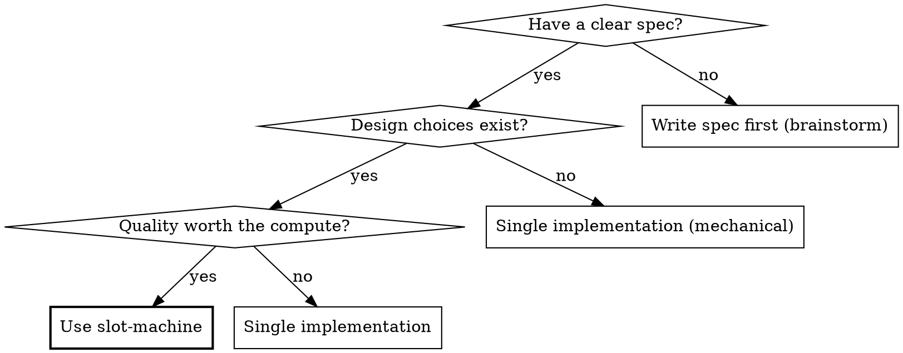

# Slot Machine

**Best-of-N parallel implementation for coding agents.**

Run N independent implementations of the same spec in parallel worktrees. Review each. Pick the best — or synthesize the best elements into a single winner.

**Core principle:** LLMs are probabilistic. More attempts = better outcomes. Trade compute for quality.

**Announce at start:** "I'm using the slot-machine skill to run N parallel implementations."

## What This Is NOT

Standard multi-agent patterns split DIFFERENT tasks across agents (frontend, backend, tests in parallel). Every major tool does this — it's table stakes.

**Slot-machine gives the SAME spec to N agents and compares their FULL implementations.** The value isn't parallelism — it's competition and selection. Each slot is an independent attempt at solving the same problem, not a piece of a divided workload.

If you want to split a plan into parallel tasks, use **superpowers:dispatching-parallel-agents** instead.

## When to Use



**Use when:**
- Feature is well-specified (clear enough for independent implementation)
- Quality matters more than speed or cost
- Medium complexity (1-4 hours of agent work per attempt)
- Implementation has meaningful design choices (architecture, patterns, tradeoffs)

**Don't use when:**
- Simple mechanical changes (rename, add a field, update a config)
- Feature needs heavy human-in-the-loop iteration during implementation
- You already know exactly how it should be built
- Spec is too vague for independent attempts (brainstorm first)
- Task is purely mechanical with no design choices — 5 attempts at "add a column" is burning money

## Configuration

Check for config in project's `CLAUDE.md`, `AGENTS.md`, or equivalent. User can override inline (e.g., "slot-machine this with 3 slots").

| Setting | Default | Description |
|---------|---------|-------------|
| `slots` | 5 | Number of parallel attempts |
| `approach_hints` | true | Give each slot a different architectural direction |
| `auto_synthesize` | true | Allow judge to combine elements from multiple slots |
| `max_retries` | 1 | Re-run failed slots (0 = no retry) |
| `cleanup` | true | Delete worktrees after completion |
| `implementer_model` | sonnet | Model for implementer subagents |
| `reviewer_model` | sonnet | Model for reviewer subagents |
| `judge_model` | opus | Model for judge subagent |
| `synthesizer_model` | opus | Model for synthesizer subagent |

## The Process

### Phase 1: Setup

1. **Validate the spec.** The spec (plan, requirements doc, or inline description) must be concrete enough for independent implementation. If ambiguous — stop and ask for clarification before spending compute.

   Red flags that mean "not ready":
   - "Something like..." or "maybe we could..."
   - Missing acceptance criteria
   - References to external context not provided
   - Contradictory requirements

2. **Gather project context.** Collect what implementers need to understand the codebase:
   - README or architecture docs (if they exist)
   - Key file descriptions relevant to the feature
   - Test patterns and how to run tests
   - Any CLAUDE.md conventions

   Keep context focused — don't dump the entire codebase. Implementers should get just enough to orient themselves.

3. **Ensure git repo is ready.** The project MUST be a git repository with at least one commit before Phase 2 can create worktrees. If the directory is not a git repo or has no commits:
   ```bash
   git init && git add -A && git commit -m "initial commit"
   ```
   Without this, `isolation: "worktree"` on Agent calls will fail and agents will not get isolated workspaces.

4. **Verify test baseline.** Run the project's test suite to confirm tests pass BEFORE any implementation. If tests fail now, they'll fail in every slot — stop and fix first.

5. **Detect project language.** Check file extensions in the project to select language-appropriate approach hints:
   ```bash
   LANG=$(find . -maxdepth 3 -type f \( -name '*.py' -o -name '*.ts' -o -name '*.js' -o -name '*.go' -o -name '*.rs' \) 2>/dev/null | head -20 | awk -F. '{print $NF}' | sort | uniq -c | sort -rn | head -1 | awk '{print $2}')
   case "$LANG" in
     py) HINT_LANG=python ;;
     ts|js) HINT_LANG=typescript ;;
     go) HINT_LANG=go ;;
     rs) HINT_LANG=rust ;;
     *) HINT_LANG=generic ;;
   esac
   ```
   The hint language determines which variant of hints 3, 4, 6, and 7 to use. Hints 1, 2, 5, 8, 9, and 10 are language-neutral and stay the same regardless of detected language.

6. **Assign approach hints.** If `approach_hints` is enabled, randomly assign one hint per slot (without replacement). Each hint steers toward a different architecture — see the [Approach Hints](#approach-hints) section for the full list. Use the detected `HINT_LANG` to select the correct variant for hints 3, 4, 6, and 7.

7. **Report setup to user:**
   ```
   🎰 Slot Machine: Pulling the lever with N slots
   Feature: {feature_name}
   Spec: {spec_source}
   Baseline: {test_count} tests passing
   Hints: {list of hint assignments}
   ```

### Phase 2: Parallel Implementation

**Dispatch all N implementers in a SINGLE message** using N parallel Agent tool calls. This is critical — all calls must be in one message for true parallel execution.

For each slot i (1 to N), make an Agent tool call with:

| Parameter | Value |
|-----------|-------|
| `description` | `"Slot {i}: Implement {feature_name}"` |
| `isolation` | `"worktree"` |
| `model` | configured `implementer_model` (default: `"sonnet"`) |
| `prompt` | Read `./slot-implementer-prompt.md` and fill in all `{{VARIABLES}}` |

The variables to fill in the implementer prompt template:

| Variable | Source |
|----------|--------|
| `{{SPEC}}` | Full text of the spec — paste it, don't make the subagent read a file |
| `{{APPROACH_HINT}}` | The hint assigned to this slot (or omit section if hints disabled) |
| `{{PROJECT_CONTEXT}}` | README, architecture notes, CLAUDE.md conventions, key file descriptions gathered in Phase 1. Include any user-specified skill guidance (e.g., "follow TDD", "use existing patterns in src/services/"). |
| `{{TEST_COMMAND}}` | How to run the test suite in this project |

**Worktree fallback:** If `isolation: "worktree"` fails (e.g., git repo not detected, permission issues), fall back to manual worktree creation:

```bash
for i in $(seq 1 $N); do
    git worktree add "../{feature_name}-slot-$i" -b "slot-machine/{feature_name}/slot-$i"
done
```

Then dispatch implementers WITHOUT `isolation: "worktree"`, pointing each to its worktree directory. Track worktree paths manually for cleanup in Phase 4.

**After all agents return**, process each result:

| Result | Action |
|--------|--------|
| Agent succeeded, implementer status DONE | Record worktree path + branch from result. Save implementer report. |
| Agent succeeded, status DONE_WITH_CONCERNS | Record worktree path + branch. Save report including concerns. |
| Agent succeeded, status BLOCKED or NEEDS_CONTEXT | If `max_retries` > 0: re-dispatch with additional context. Else: mark FAILED. |
| Agent errored/crashed | If `max_retries` > 0: re-dispatch fresh. Else: mark FAILED. |

**Retry handling:** When retrying, dispatch a SINGLE Agent call (not parallel) with the same template but additional context addressing the block. Use a fresh subagent — don't try to continue the failed one.

**Report progress:**
```
Implementation complete:
  ✅ Slot 1: DONE (worktree: {path})
  ✅ Slot 2: DONE_WITH_CONCERNS (worktree: {path})
  ❌ Slot 3: FAILED after retry (reason)
  ✅ Slot 4: DONE (worktree: {path})
  ✅ Slot 5: DONE (worktree: {path})
```

**Minimum viable:** At least 2 successful slots needed for meaningful comparison. If fewer than 2 succeed, report to user and recommend: re-run with different slot count, fix spec issues, or manual implementation.

### Phase 3: Review and Judgment

**The review/judgment pipeline is the skill's core value.** Baseline testing showed that Claude naturally does parallel dispatch and even synthesis — but it centralizes all evaluation in the orchestrator. This phase delegates evaluation to specialized agents for higher-quality, unbiased assessment.

#### Step 0: Run pre-checks (code-based, before LLM reviewers)

Before dispatching reviewers, run code-based checks in each successful slot's worktree. These give reviewers FACTS, not things to discover:

```bash
# For each worktree:
cd {worktree_path}

# 1. Test results
{test_command} 2>&1  # capture pass/fail count

# 2. Files created/modified
git diff --name-only HEAD~1

# 3. Line counts
find src/ tests/ -name "*.py" -exec wc -l {} + 2>/dev/null || true

# 4. Import validation (catch broken imports early)
python3 -c "import importlib, pathlib; [importlib.import_module(p.stem) for p in pathlib.Path('src').glob('*.py')]" 2>&1 || true

# 5. Linter (if available — non-blocking)
python3 -m ruff check src/ tests/ 2>/dev/null || python3 -m flake8 src/ tests/ 2>/dev/null || true
```

Feed ALL pre-check results to the reviewer as `{{PRE_CHECK_RESULTS}}`. The more factual data the reviewer has, the less it has to discover by reading code — and the more it can focus on judgment calls (bugs, design quality) that require reasoning.

Collect results as `{{PRE_CHECK_RESULTS}}` for each slot.

#### Step 1: Dispatch reviewers for all successful slots

**Dispatch all reviewers in a SINGLE message** — one parallel Agent tool call per successful slot.

For each successful slot i, make an Agent tool call with:

| Parameter | Value |
|-----------|-------|
| `description` | `"Review Slot {i} implementation"` |
| `model` | configured `reviewer_model` (default: `"sonnet"`) |
| `prompt` | Read `./slot-reviewer-prompt.md` and fill in all `{{VARIABLES}}` |

The variables to fill in the reviewer prompt template:

| Variable | Source |
|----------|--------|
| `{{SPEC}}` | Full text of the original spec |
| `{{IMPLEMENTER_REPORT}}` | The implementer's status report (what they claim they built) |
| `{{WORKTREE_PATH}}` | Path to this slot's worktree (from Phase 2 results) |
| `{{SLOT_NUMBER}}` | This slot's number |
| `{{PRE_CHECK_RESULTS}}` | Test output, file list, line counts from Step 0 |
| `{{APPROACH_HINT_USED}}` | The approach hint that was given to this slot's implementer |

The reviewer reads actual code in the worktree — it does NOT have `isolation: "worktree"` (it inspects an existing worktree, not its own).

After all reviewers return, collect all reviews.

#### Step 2: Dispatch the judge

Make a SINGLE Agent tool call. **The judge MUST use the most capable model** — this is where architectural judgment matters most:

| Parameter | Value |
|-----------|-------|
| `description` | `"Judge Slot Machine results for {feature_name}"` |
| `model` | **`"opus"`** (or configured `judge_model`) — do NOT omit this parameter |
| `prompt` | Read `./slot-judge-prompt.md` and fill in all `{{VARIABLES}}` |

The variables to fill in the judge prompt template:

| Variable | Source |
|----------|--------|
| `{{SPEC}}` | Full text of the original spec |
| `{{ALL_SCORECARDS}}` | All reviewer scorecards concatenated |
| `{{WORKTREE_PATHS}}` | List of all slot worktree paths (for targeted code inspection) |
| `{{SLOT_COUNT}}` | Number of successful slots |

The judge returns one of three verdicts:
- **PICK** — one slot is the clear winner
- **SYNTHESIZE** — multiple slots have complementary strengths worth combining
- **NONE_ADEQUATE** — all slots have critical issues

### Phase 4: Resolution

#### If PICK:

1. The judge named a winning slot. Merge its branch:
   ```bash
   # From the main working directory
   git merge {winning_branch} --no-ff -m "feat: {feature_name} (slot-machine winner: slot {N})"
   ```

2. Run the full test suite to verify the merge is clean.

3. If tests fail: investigate. The worktree passed tests in isolation — merge conflicts or environment differences are the likely cause. Fix before proceeding.

#### If SYNTHESIZE:

1. The judge produced a concrete synthesis plan (which base slot, what to port from where).

2. Dispatch the synthesizer as a SINGLE Agent tool call:

   | Parameter | Value |
   |-----------|-------|
   | `description` | `"Synthesize best elements for {feature_name}"` |
   | `isolation` | `"worktree"` |
   | `model` | **`"opus"`** (or configured `synthesizer_model`) — do NOT omit this parameter |
   | `prompt` | Read `./slot-synthesizer-prompt.md` and fill in all `{{VARIABLES}}` |

   The variables to fill in the synthesizer prompt template:

   | Variable | Source |
   |----------|--------|
   | `{{SPEC}}` | Full text of the original spec |
   | `{{SYNTHESIS_PLAN}}` | The judge's synthesis plan (which base, what to port) |
   | `{{WORKTREE_PATHS}}` | All slot worktree paths the synthesizer needs to read from |
   | `{{BASE_SLOT_PATH}}` | The worktree path of the base slot specifically |

3. Run full test suite to verify.

4. **Post-synthesis review.** Dispatch ONE reviewer to check the synthesized code for integration issues:

   | Parameter | Value |
   |-----------|-------|
   | `description` | `"Review synthesis for {feature_name}"` |
   | `model` | configured `reviewer_model` (default: `"sonnet"`) |
   | `prompt` | Read `./slot-reviewer-prompt.md` and fill in `{{VARIABLES}}` using the synthesis worktree |

   The reviewer checks:
   - Coherence: does it read like one person wrote it?
   - Integration: did porting introduce bugs or naming conflicts?
   - Coverage: did any tests get dropped during synthesis?

   If the reviewer finds critical issues, fix them before merging. Important/minor issues can be noted in the final report.

5. After synthesizer completes, merge its branch:
   ```bash
   git merge {synthesis_branch} --no-ff -m "feat: {feature_name} (slot-machine synthesis: slot {base} base + elements from slots {donors})"
   ```

#### If NONE_ADEQUATE:

1. Report the judge's analysis to the user.
2. Recommend next steps based on judge's reasoning:
   - Re-run with an adjusted or clarified spec
   - Re-run with more slots
   - Manual intervention on the best attempt
   - Abandon and rethink the approach
3. **Do NOT auto-retry** — the user decides.

#### Cleanup

If `cleanup` is true (default), remove all worktrees:

```bash
# For each worktree path tracked during the run:
git worktree remove {worktree_path} --force
# The --force handles uncommitted changes in non-winning slots

# Branches are cleaned up automatically if they were only in the worktree
# For any lingering branches:
git branch -D {branch_name}
```

If `cleanup` is false, report worktree locations so the user can inspect them.

#### Final Report

```
🎰 Slot Machine Complete
Feature: {feature_name}
Slots: N ({succeeded} succeeded, {failed} failed)
Verdict: {PICK slot-N | SYNTHESIZE (base + donors) | NONE_ADEQUATE}
Winner score: {score}/5
Tests: {count} passing
Wall clock: {duration}
```

#### Metrics (optional)

If the project has a `.slot-machine/` directory (or `metrics_dir` is configured), write run metrics:

```bash
mkdir -p .slot-machine
cat > .slot-machine/run-$(date +%Y%m%d-%H%M%S).json << 'METRICS'
{
  "schema_version": 1,
  "timestamp": "...",
  "feature": "...",
  "config": { "slots": N, ... },
  "results": { "verdict": "...", ... },
  "reviewers": { ... },
  "agents": { "total_dispatched": N, ... },
  "final_output": { "test_count": N, ... }
}
METRICS
```

See `tests/fixtures/sample-metrics.json` for the full schema. Metrics enable tracking improvement across runs — which approach hints win, how often synthesis triggers, whether reviewer differentiation improves over time.

The `reviewers` section tracks effectiveness per slot: `findings_total`, `findings_acted_on` (used by judge), `findings_ignored` (correct but unused), `false_positives`. The `convergent_findings` array lists issues found independently by multiple reviewers — these are the highest-confidence signals. When golden issues are available (from planted-bug test fixtures), `precision` and `recall` are computed.

## Implementer Status Handling

Implementer subagents report one of four statuses in their output:

| Status | Meaning | Orchestrator Action |
|--------|---------|-------------------|
| **DONE** | Implementation complete, tests pass | Proceed to review |
| **DONE_WITH_CONCERNS** | Complete but implementer has reservations | Proceed to review — include concerns in reviewer context |
| **BLOCKED** | Can't proceed — architectural uncertainty, missing info | Retry with more context if retries remain. If still blocked, mark failed. |
| **NEEDS_CONTEXT** | Spec is ambiguous or missing information | Provide the missing context and re-dispatch. If context isn't available, mark failed. |

**Never ignore BLOCKED or NEEDS_CONTEXT.** These indicate real problems. Forcing a retry without changes produces the same failure.

## Model Selection

Use the Agent tool's `model` parameter to assign appropriate model tiers:

| Role | Default Model | Configurable As | Rationale |
|------|--------------|-----------------|-----------|
| Implementer | `"sonnet"` | `implementer_model` | Mechanical implementation work — standard model is sufficient |
| Reviewer | `"sonnet"` | `reviewer_model` | Structured evaluation against criteria — standard model handles this well |
| Judge | `"opus"` | `judge_model` | Cross-implementation comparison requires best architectural judgment |
| Synthesizer | `"opus"` | `synthesizer_model` | Combining code from multiple sources coherently needs strong reasoning |

The user can override any of these in config or inline. For cost-sensitive runs, `"sonnet"` for all roles is viable. For maximum quality, `"opus"` everywhere.

## Approach Hints

When `approach_hints` is enabled (default: true), each slot gets a different architectural direction to encourage genuinely divergent implementations. Assign randomly without replacement.

The goal is structural diversity — different designs, not different priorities on the same design. Each hint steers toward a distinct architecture so the judge sees real alternatives.

**Default hints (for N ≤ 5):**

1. "Use the simplest possible approach — single class, minimal API surface, fewest lines of code that fully satisfy the spec. When in doubt, do less."
2. "Design for robustness — thorough input validation, defensive error handling, edge case coverage. Think about what happens with invalid inputs, concurrent access, and resource exhaustion."
3. *(language-aware — select the variant matching the detected project language)*
4. *(language-aware — select the variant matching the detected project language)*
5. "Build for extensibility — use protocols, interfaces, dependency injection, or the strategy pattern. Make it easy to swap implementations or add new behavior without modifying existing code."

**Extended hints (for N > 5):**

6. *(language-aware — select the variant matching the detected project language)*
7. *(language-aware — select the variant matching the detected project language)*
8. "Observable and debuggable — add structured logging, metrics hooks, and clear error messages. Optimize for production debugging, not just correctness."
9. "Follow existing codebase patterns exactly — match the project's style, naming conventions, and architectural patterns precisely. Integrate, don't innovate."
10. "Security-hardened — defense in depth, input sanitization, least privilege. Design as if the caller is untrusted."

**Language-aware hint variants:**

Select the variant matching the detected `HINT_LANG` from Phase 1, step 5.

**Hint 3 — Data-oriented / functional approach:**

| Language | Hint |
|----------|------|
| python | "Explore a functional or data-oriented approach — use dataclasses, named tuples, or plain functions instead of classes where possible. Prefer immutability and composition over inheritance." |
| typescript | "Explore a functional or data-oriented approach — use plain objects with type guards, discriminated unions, or pure functions instead of classes where possible. Prefer immutability and composition over inheritance." |
| go | "Explore a data-oriented approach — use plain structs with exported fields, table-driven logic, or standalone functions instead of method-heavy types. Prefer composition via embedding over interface hierarchies." |
| rust | "Explore a data-oriented approach — use enums with variants, tuple structs, or free functions instead of trait-heavy designs. Prefer owned data and pattern matching over dynamic dispatch." |
| generic | "Explore a functional or data-oriented approach — use simple data structures and pure functions instead of complex class hierarchies. Prefer immutability and composition over inheritance." |

**Hint 4 — Ergonomic / idiomatic API:**

| Language | Hint |
|----------|------|
| python | "Design around a fluent or context-manager API — make the interface Pythonic with `with` statements, chaining, or protocol support (`__enter__`, `__iter__`, etc). The API ergonomics matter as much as the internals." |
| typescript | "Design around a fluent or builder API — make the interface ergonomic with method chaining, the `using` keyword for resource management, or `Symbol.iterator` for custom iteration. API ergonomics matter as much as internals." |
| go | "Design around an idiomatic Go API — use functional options for configuration, `io.Reader`/`io.Writer` for streaming, and `context.Context` for cancellation. The API should feel natural to Go developers." |
| rust | "Design around an ergonomic Rust API — use the builder pattern, `impl Into<T>` for flexible inputs, the `Iterator` trait for streaming, and `Drop` for resource cleanup. The API should feel natural to Rust developers." |
| generic | "Design around a fluent or ergonomic API — make the interface pleasant to use with method chaining, resource management patterns, or iterator support. API ergonomics matter as much as internals." |

**Hint 6 — Async / concurrency-first:**

| Language | Hint |
|----------|------|
| python | "Async-first design — use asyncio primitives (Event, Lock, Semaphore) as the core, with a sync wrapper for backwards compatibility." |
| typescript | "Async-first design — use Promises, async generators, and AbortController as the core primitives, with synchronous wrappers where needed." |
| go | "Concurrency-first design — use goroutines, channels, and select as the core primitives. Design for concurrent access from the start." |
| rust | "Async-first design — use tokio or async-std primitives (Mutex, Semaphore, channels) as the core, with a blocking wrapper for sync callers." |
| generic | "Concurrency-first design — use the language's native async or threading primitives as the core. Design for concurrent access from the start." |

**Hint 7 — Decorator / wrapper pattern:**

| Language | Hint |
|----------|------|
| python | "Decorator pattern — expose the core functionality as a decorator or function wrapper so users can apply it with `@rate_limit` syntax." |
| typescript | "Decorator or middleware pattern — expose the core functionality as a higher-order function, middleware, or TypeScript decorator so users can apply it declaratively." |
| go | "Middleware pattern — expose the core functionality as a wrapper function or http.Handler middleware so users can compose it with existing handlers." |
| rust | "Macro or newtype pattern — expose the core functionality as a procedural macro, derive macro, or newtype wrapper so users can apply it declaratively." |
| generic | "Wrapper pattern — expose the core functionality as a decorator, middleware, or wrapper so users can apply it declaratively to existing code." |

Each hint is a nudge, not a mandate. Every implementation must still fully satisfy the spec regardless of its hint.

## Common Mistakes

### Skipping spec validation
- **Problem:** Vague spec → N implementations that all miss the mark in different ways → expensive waste
- **Fix:** Validate spec is concrete enough BEFORE spinning up slots. If ambiguous, ask.

### Dumping too much context
- **Problem:** Giving implementers the entire codebase burns their context window on irrelevant information
- **Fix:** Curate context — README, relevant architecture notes, key files only. Implementers can read more if needed.

### Judge reading all code from scratch
- **Problem:** Judge burns context reading N full implementations
- **Fix:** Judge reads scorecards FIRST, only does targeted code inspection where scorecards diverge or flag issues

### Synthesis that creates Frankenstein code
- **Problem:** Cherry-picking from multiple implementations creates inconsistent code
- **Fix:** Synthesizer uses ONE slot as base, ports SPECIFIC elements. Full test suite must pass. Self-review for coherence.

### Running on mechanical tasks
- **Problem:** 5 parallel attempts at "add a field to this model" is burning money
- **Fix:** Only use slot-machine when implementation has meaningful design choices

### Retrying without changes
- **Problem:** Re-dispatching a BLOCKED slot with the same context produces the same failure
- **Fix:** Add context, clarify the spec, or provide the missing information before retrying

## Red Flags — STOP If You Catch Yourself Doing These

**The #1 baseline failure mode** (observed in Task 0 testing without the skill): the orchestrator reads all implementations itself, makes an ad hoc comparison, and writes the synthesis — centralizing everything instead of delegating to specialized reviewer/judge/synthesizer agents. The review and judgment pipeline IS the skill's value. Don't collapse it.

| Thought / Action | What's Wrong |
|-----------------|-------------|
| "I'll just read all the code and compare them myself" | **This is the most common shortcut.** Dispatch independent reviewer agents per slot. Your job is orchestration, not evaluation. Blind review by fresh agents prevents bias from seeing all implementations simultaneously. |
| "I'll make a quick comparison table instead of formal scorecards" | A comparison table is not a scorecard. Each slot needs independent review with 6 weighted criteria, issue categorization, and a verdict. The judge needs structured input, not your summary. |
| "I can write the synthesis myself, I've already read the code" | Dispatch the synthesizer agent. It works from the judge's plan with a single base + targeted ports. Ad hoc synthesis by the orchestrator produces Frankenstein code. |
| "I'll split the spec into different tasks for each slot" | That's standard parallel agents, not slot-machine. Each slot gets the FULL spec. |
| "3 slots is probably enough" | Use the configured count. User chose N for a reason. Don't second-guess. |
| "I'll skip the judge and just merge the highest scorer" | Judge does targeted code inspection. Scorecard alone isn't enough for the decision. |
| "Synthesis sounds risky, I'll just PICK" | If multiple slots have complementary strengths, synthesis produces a better result. Trust the process. |
| "This spec is probably clear enough" | Validate. Ambiguous specs × N slots = N different wrong implementations = expensive waste. |
| "Reviewing each separately is overkill" | Structured review is what makes judgment possible. Ad hoc comparison = ad hoc results. |

**All of these mean you're about to shortcut the review/judgment pipeline. That pipeline is the entire point of this skill.**

## Integration

- **superpowers:brainstorming** → Produces the spec that slot-machine consumes. Run brainstorming BEFORE slot-machine if requirements are unclear.
- **superpowers:writing-plans** → Can produce the plan/spec. Slot-machine gives the ENTIRE spec to each slot (not individual tasks).
- **superpowers:using-git-worktrees** → Slot-machine uses `isolation: "worktree"` which follows the same underlying git worktree mechanics.
- **superpowers:test-driven-development** → Each implementer should follow TDD if the project uses it. Include TDD guidance in the spec if applicable.
- **superpowers:finishing-a-development-branch** → After slot-machine produces a winner, use this for final merge/PR/cleanup.

**Key difference from subagent-driven-development:** SDD splits a plan into sequential tasks (one agent per task). Slot-machine gives the ENTIRE spec to N agents and compares their full implementations. They are complementary — you could use SDD within each slot for large features.
