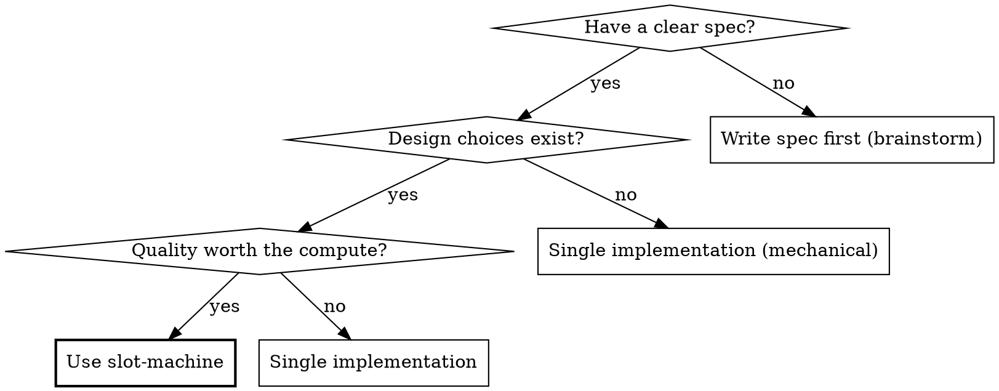

# Slot Machine

**Best-of-N parallel implementation for any task type.**

Run N independent attempts at the same spec in parallel. Review each. Pick the best — or synthesize the best elements into a single winner.

**Core principle:** LLMs are probabilistic. More attempts = better outcomes. Trade compute for quality.

**Announce at start:** "I'm using the slot-machine skill ({profile_name} profile) to run N parallel implementations."

## What This Is NOT

Standard multi-agent patterns split DIFFERENT tasks across agents (frontend, backend, tests in parallel). Every major tool does this — it's table stakes.

**Slot-machine gives the SAME spec to N agents and compares their FULL attempts.** The value isn't parallelism — it's competition and selection. Each slot is an independent attempt at the same task, not a piece of a divided workload. This applies to any task type — coding, writing, or custom profiles.

If you want to split a plan into parallel tasks, use **superpowers:dispatching-parallel-agents** instead.

## When to Use



**Use when:**
- Feature is well-specified (clear enough for independent implementation)
- Quality matters more than speed or cost
- Medium complexity (1-4 hours of agent work per attempt)
- Implementation has meaningful design choices (architecture, patterns, tradeoffs)

**Don't use when:**
- Simple mechanical changes (rename, add a field, update a config)
- Feature needs heavy human-in-the-loop iteration during implementation
- You already know exactly how it should be built
- Spec is too vague for independent attempts (brainstorm first)
- Task is purely mechanical with no design choices — 5 attempts at "add a column" is burning money

## Configuration

Project config can live in `AGENTS.md`, `CLAUDE.md`, or both; treat them as equal first-class sources. Read whichever exists, or both if both exist. When both exist, merge non-conflicting slot-machine config from both files. The prefixed project keys are `slot-machine-profile` and `slot-machine-slots`; the remaining settings from the table below use their bare names (`slots`, `quiet`, `cleanup`, `manual_handoff`, `auto_synthesize`, `max_retries`, `approach_hints`, and the `*_model` overrides). If both files define the same key, prefer the file for the active host: `AGENTS.md` in Codex, `CLAUDE.md` in Claude. User can override inline (e.g., "slot-machine this with 3 slots").

| Setting | Default | Description |
|---------|---------|-------------|
| `slots` | 3 | Number of parallel attempts |
| `approach_hints` | true | Give each slot a different architectural direction |
| `auto_synthesize` | true | Allow judge to combine elements from multiple slots |
| `max_retries` | 1 | Re-run failed slots (0 = no retry) |
| `manual_handoff` | false | Stop after per-slot review and hand reviewed candidates back to the user for manual selection and merge |
| `cleanup` | true | Delete worktrees after completion |
| `quiet` | false | Suppress progress tables — only show final verdict + output path. For autonomous loops. |
| `implementer_model` | inherit | Model for implementer subagents (inherits from session if not set) |
| `reviewer_model` | inherit | Model for reviewer subagents (inherits from session if not set) |
| `judge_model` | inherit | Model for judge subagent (inherits from session if not set) |
| `synthesizer_model` | inherit | Model for synthesizer subagent (inherits from session if not set) |

## Profile Loading

Profiles define the task-specific content for a slot-machine run: approach hints, agent prompts, isolation strategy, and pre-check commands. SKILL.md is a domain-agnostic orchestration engine — all task-specific content comes from the active profile.

### Profile Discovery (order of precedence)

1. **Explicit:** user says `--profile X` or `profile: X`
2. **Project default:** `AGENTS.md`, `CLAUDE.md`, or both set `slot-machine-profile: X`. Treat them as equal first-class sources and read whichever exists, or both if both exist. Merge non-conflicting slot-machine config from both files; if both define the same key, prefer the active host file: `AGENTS.md` in Codex, `CLAUDE.md` in Claude.
3. **Local:** `./profiles/` folders in the project
4. **User:** `~/.slot-machine/profiles/` (community or personal profiles)
5. **Skill:** `profiles/` in the slot-machine skill directory (the built-in profiles)
6. **Fallback:** `coding`

### Profile Selection Logic

- If explicit or project-configured → use it
- If not → auto-detect between coding/writing from spec signals:
  - **Coding signals:** implement, build, create, fix, refactor; references to tests, APIs, functions
  - **Writing signals:** write, draft, compose, describe; references to audience, tone, structure
- If not confident → ask one question: "This spec could be a coding task or a writing task. Which profile should I use?"

### Deterministic Resolution Procedure

Resolve profile names against exact roots. Do not rely on open-ended recursive globs as the primary lookup path.

1. Build these roots at the start of profile resolution:
   - `PROJECT_PROFILE_ROOT="$PWD/profiles"`
   - `USER_PROFILE_ROOT="$HOME/.slot-machine/profiles"`
   - `SKILL_PROFILE_ROOT="profiles/"` under the physical slot-machine skill directory
2. Resolve the skill directory to a physical path before reading built-in profiles or resolving inherited bases. If the host provides a skill base directory, canonicalize it first:
   ```bash
   REAL_SKILL_DIR=$(cd "{skill_dir}" 2>/dev/null && pwd -P)
   ```
   On Claude-hosted runs, when you need the installed skill directory and only have the installed path, canonicalize that installed path the same way before using `Glob` or `Read`. Built-in profile discovery must work whether the installed skill directory is a real directory or a symlink. Preserve `REAL_SKILL_DIR` for all built-in assets, not just profiles: the supported Codex runtime helper lives at `"$REAL_SKILL_DIR/scripts/codex-slot-runner.py"`.
3. When selecting a named profile `X`, check exact directories in precedence order: `PROJECT_PROFILE_ROOT/X`, then `USER_PROFILE_ROOT/X`, then `REAL_SKILL_DIR/profiles/X`.
4. When `extends: X` appears, rerun the same named-profile lookup for `X`. Do not assume the base profile lives beside the extending profile.
5. Prefer `Read` on exact numbered files once you know the resolved directory. If you need to enumerate built-in files inside the canonicalized skill directory, scope the lookup to the physical path, for example:
   ```bash
   find -L "$REAL_SKILL_DIR/profiles/$PROFILE_NAME" -maxdepth 1 -type f -name '*.md' | sort
   ```
   A scoped `Glob` inside `REAL_SKILL_DIR/profiles/$PROFILE_NAME` is also acceptable after canonicalization.
6. If the selected profile or any inherited base still cannot be resolved after checking those exact roots, stop. Do not broaden the search with recursive `**/profiles/...` fallbacks.

### Profile Inheritance Resolution

- If profile has `extends: X`, resolve base profile `X` using the deterministic procedure above, then read base profile `X` first
- Overlay the extending profile's files on top
- Files present in extending profile's folder replace base files entirely
- Missing files are inherited from the base folder
- Frontmatter fields override individually
- Max one level of inheritance

### Resolution Guardrails

- Resolve the active profile name once. As soon as a named profile is found at one discovery layer, stop scanning lower-precedence layers for that same profile name.
- If the active profile has `extends: X`, resolve `X` immediately using the same precedence order. Built-in `coding` and `writing` profiles at the skill layer are valid base fallbacks.
- Build the effective profile file set before continuing: `0-profile.md`, `1-implementer.md`, `2-reviewer.md`, `3-judge.md`, and `4-synthesizer.md`. For each file, use the extending profile's copy if present; otherwise use the resolved base profile's file.
- If the active profile or its base cannot be resolved after one pass through the discovery order, stop with `BLOCKED` and explain the missing profile or file. Do not continue setup-time discovery loops, repeated directory scans, or repeated config reads.

### Profile Resolution Failure

If the selected profile or any inherited base cannot be resolved:

- Write a blocked-mode `{RUN_DIR}/result.json` (see [Result artifact](#part-3-result-artifact--always-write-a-machine-readable-json-file-to-the-run-directory))
- Refresh `.slot-machine/runs/latest` to that run directory
- Report `BLOCKED` with the missing profile/base and stop before slot parsing or dispatch

### Universal Variables

SKILL.md injects these variables into ALL profile prompts. If a variable isn't relevant for the active profile (e.g., `{{PRE_CHECK_RESULTS}}` for writing), pass an empty string.

| Variable | Description |
|----------|-------------|
| `{{SPEC}}` | Full text of the spec/brief |
| `{{APPROACH_HINT}}` | The hint assigned to this slot |
| `{{PROJECT_CONTEXT}}` | README, architecture notes, AGENTS.md / CLAUDE.md conventions, reference materials |
| `{{SLOT_NUMBER}}` | This slot's number |
| `{{PRE_CHECK_RESULTS}}` | Output from pre-check commands (empty string if `pre_checks` is null) |
| `{{IMPLEMENTER_REPORT}}` | The implementer's status report |
| `{{WORKTREE_PATH}}` | Path to this slot's worktree or output file |
| `{{ALL_SCORECARDS}}` | All reviewer scorecards concatenated |
| `{{WORKTREE_PATHS}}` | List of all slot worktree/output paths |
| `{{SLOT_COUNT}}` | Number of successful slots |
| `{{SYNTHESIS_PLAN}}` | The judge's synthesis plan |
| `{{BASE_SLOT_PATH}}` | The worktree/output path of the base slot |
| `{{APPROACH_HINT_USED}}` | The approach hint given to the implementer (used in reviewer context) |
| `{{TEST_COMMAND}}` | How to run the test suite (empty string if not applicable) |

When filling `{{TEST_COMMAND}}` for Python repos, prefer `python3 -m pytest ...` unless the project already standardizes on another command. Do not assume a bare `python` executable exists.

## Slot Definitions

Slots can be configured per-slot instead of using the same profile implementer for all. Two axes compose with `+`:

- **Skills** (`/superpowers:test-driven-development`, `$superpowers:test-driven-development`, `/ce:work`) — methodology guidance. Accept both Claude-style `/` and Codex-style `$` prefixes at parse time. Injected into the prompt of whatever harness runs the slot.
- **Harnesses** (`claude`, `codex`, `gemini`) — which AI system executes. No skill prefix. Determines the dispatch mechanism.

### Slot Definition Sources (precedence)

1. **Inline:** Parsed from the user's command. Slash-prefixed or dollar-prefixed names are skills, bare names are harnesses. `+` composes them. `default` means profile implementer + approach hint.
2. **AGENTS.md or CLAUDE.md config:** Project config can live in either file or both as equal first-class sources. Read `slot-machine-profile` and `slot-machine-slots` from whichever exists, or both if both exist. Merge non-conflicting slot-machine config from both files; if both define the same key, prefer the active host file: `AGENTS.md` in Codex, `CLAUDE.md` in Claude:
   ```markdown
   slot-machine-profile: coding
   slot-machine-slots:
     - /superpowers:test-driven-development
     - $superpowers:test-driven-development + codex
     - claude
     - codex
     - default
   ```
3. **Profile defaults:** If no slot definitions found, all slots use the profile's implementer prompt with randomly assigned approach hints. This is the Phase 1 behavior — unchanged.

### Parsing Rules

- If the user specifies slot definitions AND a slot count higher than the number of definitions, remaining slots get profile defaults with approach hints
- If the user specifies only slot definitions (no count), the slot count equals the number of definitions
- Each slot definition is a tuple: `(normalized_skill, harness)`:
  - `default` → `(null, null)` — profile implementer + hint
  - `/superpowers:test-driven-development` → `("superpowers:test-driven-development", null)` — skill-only slot
  - `$superpowers:test-driven-development` → `("superpowers:test-driven-development", null)` — same normalized skill-only slot
  - `claude` → `(null, "claude")` — Claude harness with generic prompt
  - `codex` → `(null, "codex")` — Codex harness with generic prompt
  - `/superpowers:test-driven-development + codex` → `("superpowers:test-driven-development", "codex")` — Codex with skill
  - `$superpowers:test-driven-development + codex` → `("superpowers:test-driven-development", "codex")` — same normalized Codex-with-skill slot

### Skill Syntax Normalization

Slot definitions accept both Claude-style `/skill-name` and Codex-style `$skill-name` syntax. Normalize each parsed skill internally to a host-neutral skill reference with no leading sigil, such as `superpowers:test-driven-development`.

When dispatching that host-neutral skill reference to a harness, translate it into the harness-native syntax:

- **Claude harness:** `superpowers:test-driven-development` → `/superpowers:test-driven-development`
- **Codex harness:** `superpowers:test-driven-development` → `$superpowers:test-driven-development`
- **Future harnesses:** translate the same host-neutral skill reference into their native syntax

The skill is invoked natively by the target harness — Claude and Codex load their own copy of the skill, not a text summary. The user is responsible for ensuring the skill is installed on the target harness.

### Approach Hints and Skill Slots

Approach hints only apply to `default` slots. Skill-based slots do NOT get approach hints — the skill IS the diversity mechanism. When mixing skill and default slots, assign hints only to the default slots.

### Poor Slot Candidate Warning

Apply this warning after normalizing the parsed skill name to its host-neutral form. If the normalized skill name matches a known multi-agent orchestrator (`superpowers:subagent-driven-development`, `superpowers:executing-plans`), warn the user: "⚠ {skill} is a multi-agent orchestrator — running it inside a slot creates nested pipelines (slower, redundant review). Consider using a single-session skill like /superpowers:test-driven-development instead." Do not block — the user may have a reason.

## Skill Discovery

When the user says "all my skills", "all implementation skills", or uses `--discover`, the orchestrator scans for available slot-compatible skills and proposes a slot configuration.

### Trigger Rules (strict — never auto-fires)

| User says | Discovery fires? |
|-----------|-----------------|
| `/slot-machine this` | No — default profile + hints |
| `/slot-machine this with 3 slots` | No — default hints |
| `/slot-machine this with /superpowers:test-driven-development and codex` | No — explicit list |
| `/slot-machine this with all my skills` | **Yes** |
| `/slot-machine this using all implementation skills` | **Yes** |
| `/slot-machine --discover` | **Yes** |

Discovery ONLY fires on explicit "all my/implementation skills" language or `--discover`. Never as a suggestion. Never as a default.

### Detection Heuristic

1. Read skill descriptions from the system prompt
2. Filter by signals:
   - **Include:** "implement", "build", "execute plan", "write code", "development workflow"
   - **Exclude:** "review", "deploy", "ship", "test-only", "audit", "monitor", "debug"
3. Normalize candidate skill names to host-neutral form before filtering. Filter out known poor candidates by normalized name: `superpowers:subagent-driven-development`, `superpowers:executing-plans`
4. Check for external harnesses: run `which codex`, `which gemini` via Bash
5. Propose the filtered list to the user

### First-Time Flow

```
I scanned your installed skills and detected these slot-compatible workflows:

  1. /superpowers:test-driven-development — test-first development
  2. /ce:work — pattern-matching execution
  3. codex — OpenAI Codex (external harness)

Use all 3 as slots? Or adjust?
```

User confirms or edits. Save selection to `~/.slot-machine/config.md`:

```markdown
## Discovered Implementation Skills
- /superpowers:test-driven-development
- /ce:work
- codex
```

### Subsequent Runs

"All my skills" loads the saved list without re-scanning. User can re-trigger a fresh scan with `--discover`.

## The Process

### Phase 1: Setup

0. **Create run directory.** Create the run storage directory and add `.slot-machine/` to `.gitignore` if not already present:
   ```bash
   RUN_DIR_REL=".slot-machine/runs/$(date +%Y-%m-%d)-{feature_slug}"
   RUN_DIR="$PWD/$RUN_DIR_REL"
   mkdir -p "$RUN_DIR"
   grep -q '.slot-machine/' .gitignore 2>/dev/null || echo '.slot-machine/' >> .gitignore
   ```
   Persist `RUN_DIR` as the absolute path for this run. All review, verdict, and result artifacts must be written via that absolute path, not a cwd-relative redirect. Before every artifact write later in the run, re-run `mkdir -p "$RUN_DIR"` so artifact persistence never depends on shell state.
   All artifacts from this run will be saved to `{RUN_DIR}/`.
   This is the first setup checkpoint. Create `RUN_DIR` before profile resolution, further exploratory reads, repeated profile scans, or slot-introspection loops. If you cannot create it, emit `BLOCKED` with the missing prerequisite instead of continuing setup-time introspection.

1. **Load profile.** Follow the [Profile Loading](#profile-loading) section to determine the active profile name, resolve its directory once, and read `0-profile.md` for config. If the active profile has `extends: X`, resolve the base profile immediately and build the effective file set (`0-profile.md` through `4-synthesizer.md`) before moving on. Do not keep scanning profile directories or re-reading config once those effective files are known. If resolution fails at any point, write the blocked-mode `{RUN_DIR}/result.json`, refresh `.slot-machine/runs/latest`, report `BLOCKED` with the exact missing profile or file, and stop before slot parsing or dispatch. Report to user: "Using profile: {profile_name}" and, if applicable, "inherits: {base_profile_name}".

2. **Parse slot definitions.** Check for slot definitions in precedence order: (1) inline in the user's command, (2) `slot-machine-slots` in `AGENTS.md`, `CLAUDE.md`, or both, treating them as equal first-class sources and reading whichever exists or both if both exist, merging non-conflicting slot-machine config from both files and preferring the active host file if both define the same key, (3) fall back to profile defaults. Record the slot list — each slot is `(normalized_skill, harness)` or `default`. Check harness availability (see below).

   **Check harness availability and detect model.** For each slot that specifies a harness:
   - `codex`: Run `which codex` via Bash. If not found, warn: 'Codex CLI not found — slot {i} will fall back to the native host path. Install: `npm install -g @openai/codex`'. Change the slot's harness to `null` (falls back to the native host with the same skill guidance if any). If found, read the Codex model version from `~/.codex/config.toml` (look for `model = "..."` line). Record this as the slot's model identifier (e.g., `gpt-5.4`).
   - `claude`: Run `which claude` via Bash and record the reported or configured Claude model identifier if available; otherwise record `unknown`. For native Claude host rows in the execution matrix, that is enough because the slot stays on the host-native path. For explicit Claude slots that use the external Claude harness path, do not silently fall back — dispatch the slot through `claude -p` and normalize the actual command outcome per slot.
   - **Claude Code slots:** The model is the session model (e.g., `claude-opus-4-6`) or the configured `implementer_model` override.
   - Future harnesses: same pattern — check binary, read model from config, warn and fall back if missing.

3. **Validate the spec.** The spec (plan, requirements doc, or inline description) must be concrete enough for independent attempts. If ambiguous — stop and ask for clarification before spending compute.

   Red flags that mean "not ready":
   - "Something like..." or "maybe we could..."
   - Missing acceptance criteria
   - References to external context not provided
   - Contradictory requirements

4. **Gather project context.** Collect what implementers need:
   - README or architecture docs (if they exist)
   - Key file descriptions relevant to the task
   - Test patterns and how to run tests (if applicable)
   - Any AGENTS.md or CLAUDE.md conventions
   - Reference materials, style guides, or source material (for writing tasks)

   Keep context focused — don't dump everything. Implementers should get just enough to orient themselves.

5. **Prepare isolation.** Check the profile's `isolation` field:
   - If `worktree`: The project MUST be a git repository with at least one commit before Phase 2 can create worktrees. If the directory is not a git repo or has no commits:
     ```bash
     git init && git add -A && git commit -m "initial commit"
     ```
     Without this, `isolation: "worktree"` on Agent calls will fail and agents will not get isolated workspaces.
     Record the original checkout before dispatching any slots so Phase 4 can restore it if needed:
     ```bash
     ORIGINAL_HEAD=$(git rev-parse HEAD)
     ORIGINAL_BRANCH=$(git symbolic-ref --short -q HEAD || true)
     ```
   - If `file`: No git repo required. Each slot will write its output to `{RUN_DIR}/slot-{i}.md`.

6. **Run pre-checks (if configured).** Read the active profile's `0-profile.md` frontmatter for the `pre_checks` field.
   - If `null` → skip this step.
   - If set → run the pre-check commands, substituting `{test_command}` with the detected test command. These establish the baseline. If baseline checks fail, stop and fix first.

7. **Assign approach hints.** If `approach_hints` is enabled, read hints from the active profile's `0-profile.md`. Randomly assign one hint per slot (without replacement). Each hint steers toward a different approach — the profile defines what diversity means for this task type.

8. **Report setup to user** using this format (top-level markdown, not inside a code block):

   **Slot Machine** — `{profile_name}` profile

   Feature: {feature_name}
   Slots: `{N}` | /ce:work (`claude-opus-4-6`), /ce:work + codex (`gpt-5.4`), codex (`gpt-5.4`), 2x default hints (`claude-opus-4-6`)

   When all slots use profile defaults (no slot definitions):

   Slots: `{N}` | Hints: {hint_1}, {hint_2}, ...

   Formatting rules for ALL orchestrator output (apply throughout Phases 1-4):
   - Tables MUST be top-level markdown — never indented or inside code blocks
   - Status values in backticks: `DONE`, `PASS`, `FAIL`, `HIGH`, `MEDIUM`, `LOW`
   - Profile name and key numbers in backticks
   - Bold for phase labels and verdicts
   - No italics anywhere — they de-emphasize in monospace terminals
   - Verdict section bounded by horizontal rules (`---`) — no blockquotes (they render as dim italics in terminals)
   - H1 (`#`) for Final Output header only

### Phase 2: Parallel Implementation

**Dispatch all N slots in a SINGLE parallel wave from a SINGLE message.** Group 1 native-host slots run through the host's native execution path in the assigned isolated slot workspace. Group 2 external-harness slots launch external CLI processes in parallel using the active profile isolation. This is critical — start the full wave together for true parallel execution.

Use this execution matrix to choose the path per slot:

| Active host | Slot harness | Execution path |
|-------------|--------------|----------------|
| Claude | Claude | Native Claude orchestration/subagent path |
| Claude | Codex | Profile-isolated slot workspace + `codex exec` |
| Codex | Codex | Native Codex slot workspace + `codex exec` |
| Codex | Claude | Profile-isolated slot workspace + `claude -p` |

Group 1 — Native-host slots: slots whose `harness_ref` is empty or matches the active host. Dispatch them through the host's native execution path in the assigned isolated slot workspace.

Group 2 — External-harness slots: slots whose `harness_ref` names the other CLI. If profile isolation is `worktree`, create one worktree per slot and launch one external CLI process per worktree. If profile isolation is `file`, create one per-slot run directory/output target under `{RUN_DIR}` and launch one external CLI process there, telling it where to write the output file.

Host-relative routing is deterministic: `claude` on Claude and `codex` on Codex are Group 1 native-host slots; `claude` on Codex and `codex` on Claude are Group 2 external-harness slots. Apply the same rule to `skill + harness` slots.

Never launch Codex slots as background Bash jobs from the orchestrator. The Codex wrapper agent must wait for `codex exec` to finish, harvest the final report or synthesize one from post-run inspection, and only then return control to the review/judge pipeline.

---

**Path A — Native-host default slots (no skill, no harness):**

Unchanged from Phase 1. Read `1-implementer.md` from the active profile, fill universal `{{VARIABLES}}`, include the assigned approach hint, and dispatch through the native-host implementer path. On Claude, the native-host implementer path is an Agent tool call with `isolation: "worktree"` (or omitted for `file`). On Codex, the native-host implementer path uses the assigned isolated slot workspace and the same prompt contract.

For each slot i (1 to N), use this native-host dispatch contract:

| Parameter | Value |
|-----------|-------|
| `description` | `"Slot {i}: Implement {feature_name}"` |
| `isolation` | `"worktree"` if profile isolation is `worktree`; omit if `file` |
| `model` | Omit unless user configured `implementer_model` — inherits from session by default |
| `prompt` | Read `1-implementer.md` from the active profile's folder and fill in all universal `{{VARIABLES}}` |

The universal variables to fill in the implementer prompt:

| Variable | Source |
|----------|--------|
| `{{SPEC}}` | Full text of the spec — paste it, don't make the subagent read a file |
| `{{APPROACH_HINT}}` | The hint assigned to this slot (or omit section if hints disabled) |
| `{{PROJECT_CONTEXT}}` | README, architecture notes, AGENTS.md / CLAUDE.md conventions, reference materials gathered in Phase 1. Include any user-specified skill guidance. |
| `{{TEST_COMMAND}}` | How to run the test suite (empty string if not applicable) |

For Python projects, prefer `python3 -m pytest ...` unless the repo already provides an explicit test command. Do not invent `python -m pytest` on systems that only guarantee `python3`.

**For `file` isolation:** Each slot writes its output to `{RUN_DIR}/slot-{i}.md`. Include this path in the prompt so the implementer knows where to write. No worktrees, no git branches.

**For `worktree` isolation — worktree fallback:** If `isolation: "worktree"` fails (e.g., git repo not detected, permission issues), fall back to manual worktree creation:

```bash
mkdir -p .slot-machine/worktrees
for i in $(seq 1 $N); do
    git worktree add ".slot-machine/worktrees/slot-$i" -b "slot-machine/{feature_name}/slot-$i"
done
```

Then dispatch implementers WITHOUT `isolation: "worktree"`, pointing each to its worktree directory. Track worktree paths manually for cleanup in Phase 4. For `worktree` isolation, save each slot's diff to `{RUN_DIR}/slot-{i}.diff` before cleanup.

---

**Path B — Native-host skill-only slots (e.g., `/superpowers:test-driven-development`, no harness):**

Do NOT read the profile's `1-implementer.md`. Dispatch through the native-host implementer path with this prompt:

```
You are implementing a feature in an isolated workspace.

IMPORTANT: You MUST invoke the normalized host-neutral skill reference `{skill_name}` using the active host's native skill mechanism before beginning implementation. On Claude, translate it to Claude skill syntax and invoke it through Claude's native skill flow. On Codex, translate it to Codex skill syntax and invoke it through the native Codex path. Follow its workflow exactly.

Specification:
{spec}

Project Context:
{project_context}

After implementation is complete, end with this report format:
**Status:** [DONE | DONE_WITH_CONCERNS | BLOCKED | NEEDS_CONTEXT]
**What I implemented:** [bullet list]
**Files changed:** [list]
**Test results:** [if applicable]
**Concerns (if any):** [issues]
```

On Claude, this is an Agent tool call with `isolation: "worktree"` for `worktree` profiles, or with `isolation` omitted for `file` profiles and an explicit `{RUN_DIR}/slot-{i}.md` destination in the prompt; translate `superpowers:test-driven-development` to `/superpowers:test-driven-development` and invoke it through Claude's native skill flow. On Codex, follow the same native-host slot workspace contract and active profile isolation; translate `superpowers:test-driven-development` to `$superpowers:test-driven-development` and invoke it through the native Codex path. Do NOT include an approach hint — the skill is the diversity mechanism.

---

**Path C — Native Claude harness slots (harness = `claude`, active host = Claude):**

These are Group 1 native-host slots. Use the native Claude implementation path in the assigned isolated slot workspace. On Claude, that means an Agent tool call with the same generic spec prompt contract used for explicit harness slots. For `skill + claude` slots, translate the normalized skill to Claude syntax such as `/superpowers:test-driven-development`.

**Path D — Native Codex harness slots (harness = `codex`, active host = Codex):**

These are Group 1 native-host slots. Use the shared Codex slot runtime helper in the assigned isolated slot workspace: `"$REAL_SKILL_DIR/scripts/codex-slot-runner.py"`. The helper is the supported Codex execution path for slot-machine. It shells out to `codex exec` in the current slot workspace, captures `codex-events.jsonl` and `codex-stderr.txt`, writes `codex-slot-report.md` plus `codex-slot-result.json`, and records the Codex `thread_id` for artifacts or manual resume. For `skill + codex` slots, translate the normalized skill to Codex syntax such as `$superpowers:test-driven-development`, write the generic Codex prompt to `codex-prompt.txt`, and invoke the same helper-backed contract described in Path F.

Never launch Codex slots as background Bash jobs. Wait for `codex exec` to finish and return a normal implementer report before reviewers or the judge can run.

---

**Path E — External Claude harness slots (harness = `claude`, active host = Codex):**

Follow the active profile isolation. If isolation is `worktree`, create one worktree per slot, `cd` into that worktree, and launch `claude -p` directly. If isolation is `file`, create a per-slot directory under `{RUN_DIR}`, launch `claude -p` there, and tell it exactly which `{RUN_DIR}/slot-{i}.md` file to write. Do not wrap this in a native subagent.

Do not silently fall back to the native host path or to Codex for explicit Claude slots. Launch the configured `claude -p` command directly and let the slot outcome reflect the real external Claude execution result.

External Claude command contract:

```bash
claude -p "{If skill specified: '/claude_skill_name\n\n'}Implement this specification. {If isolation is worktree: 'Write all files to the current directory.'}{If isolation is file: 'Write the final output to {RUN_DIR}/slot-{i}.md and do not write elsewhere.'}
Do not ask questions or wait for confirmation — make your best judgment and proceed.

Specification:
{spec}

Project context:
{project_context}

When done, provide a summary of:
- What you implemented (bullet list)
- Files created or modified
- Test results if you wrote tests
- Any concerns or issues encountered" \
  --output-format stream-json 2>claude-stderr.txt > claude-stream.jsonl
```

Failure normalization for external Claude runs:
- Missing CLI → normalize that slot to `BLOCKED`.
- Authentication failure such as `Not logged in · Please run /login` → normalize that slot to `BLOCKED` with setup guidance.
- Bootstrap or permission failure during Claude startup (for example session initialization or `session-env` errors) → normalize that slot to `BLOCKED`.
- Timeout, non-zero exit, empty report, or unparsable `stream-json` output → normalize to `BLOCKED` with the failure details attached.
- Otherwise, translate the final Claude report to the standard implementer report format.

Native skill prefix translation for external Claude:
- Use no prefix for bare `claude` slots.
- For `skill + claude` slots, translate the host-neutral skill reference to Claude syntax, for example `superpowers:test-driven-development` → `/superpowers:test-driven-development`.

**Path F — External Codex harness slots (harness = `codex`, active host = Claude):**

Follow the active profile isolation. If isolation is `worktree`, create one worktree per slot, `cd` into that worktree, and invoke the shared Codex slot runtime helper from that workspace. If isolation is `file`, create a per-slot directory under `{RUN_DIR}`, invoke the same helper there, and tell it exactly which `{RUN_DIR}/slot-{i}.md` file to write via `--expected-output-path`. Do not re-implement Codex JSON parsing inline; the helper is the supported runtime path.

The helper saves the raw `--json` JSONL stream to `codex-events.jsonl`, the stderr stream to `codex-stderr.txt`, and a normalized result/report pair to `codex-slot-result.json` and `codex-slot-report.md`. Do not assume a single event mix — current Codex runs may expose `item.completed`, `turn.completed`, or both. Never launch Codex slots as background Bash jobs; wait for `codex exec` to finish before reviewers or the judge can run.

Helper-backed Codex command contract:

```bash
cat > codex-prompt.txt <<'PROMPT'
{If skill specified: '$codex_skill_name\n\n'}Implement this specification. {If isolation is worktree: 'Write all files to the current directory.'}{If isolation is file: 'Write the final output to {RUN_DIR}/slot-{i}.md and do not write elsewhere.'}
Do not ask questions or wait for confirmation — make your best judgment and proceed.

Specification:
{spec}

Project context:
{project_context}

When done, provide a summary of:
- What you implemented (bullet list)
- Files created or modified
- Test results if you wrote tests
- Any concerns or issues encountered
PROMPT

python3 "$REAL_SKILL_DIR/scripts/codex-slot-runner.py" \
  --cwd "$PWD" \
  --prompt-file codex-prompt.txt \
  --events-file codex-events.jsonl \
  --stderr-file codex-stderr.txt \
  --result-file codex-slot-result.json \
  --report-file codex-slot-report.md \
  --sandbox workspace-write \
  --config 'model_reasoning_effort="high"' \
  {If isolation is file: --expected-output-path "{RUN_DIR}/slot-{i}.md"}
```

Post-run normalization contract for Codex slots:
- `codex-slot-result.json` is the source of truth. Do not re-parse `codex-events.jsonl` yourself unless the helper failed before writing the normalized result.
- If the helper reports `status: DONE` or `DONE_WITH_CONCERNS`, use `codex-slot-report.md` as the authoritative implementer report.
- If the helper reports `status: BLOCKED`, normalize the slot to `BLOCKED` with the helper's `failure_reason`.
- The helper preserves the Codex `thread_id`, raw log paths, observed commands, and changed-file list. Persist that metadata into per-slot artifacts and `result.json` so the user can inspect or resume Codex work later.
- Helper fallback behavior remains deterministic:
  - Prefer `git status --short --untracked-files=all` to build the changed-file list.
  - If git is unavailable, fall back to another deterministic changed-file listing such as the explicit file-isolation output path.
  - If files changed and observed command executions or output show an obvious test command or result, synthesize a standard implementer report with `Status: DONE`.
  - If files changed but no structured test summary was extractable, synthesize a standard implementer report with `Status: DONE_WITH_CONCERNS`.
  - In either synthesized case, include a concern noting that Codex emitted `turn.completed` without a structured agent_message report.
- If `codex exec` exits zero but there is no structured agent message and no meaningful workspace output from post-run inspection, normalize the slot to `BLOCKED`.

Native skill prefix translation for external Codex:
- Use no prefix for bare `codex` slots.
- For `skill + codex` slots, translate the host-neutral skill reference to Codex syntax, for example `superpowers:test-driven-development` → `$superpowers:test-driven-development`.

---

| Slot definition | Dispatch | Prompt | Isolation | Hint? |
|----------------|----------|--------|-----------|-------|
| `default` | Native host subagent path | Profile `1-implementer.md` + hint | Profile setting | Yes |
| `/superpowers:test-driven-development` | Native host execution path | "Invoke normalized skill via host-native skill mechanism" + spec | Profile setting (`worktree` or `file`) | No |
| `claude` | Native Claude path on Claude; external Claude harness on Codex | Native-host generic spec prompt or `claude -p` with spec | Profile setting (`worktree` or `file`) | No |
| `/superpowers:test-driven-development + claude` | Native Claude path on Claude; external Claude harness on Codex | Native-host skill prompt or `claude -p` with `/superpowers:test-driven-development` | Profile setting (`worktree` or `file`) | No |
| `codex` | Native Codex path on Codex; external Codex harness on Claude | `codex exec` with spec | Profile setting (`worktree` or `file`) | No |
| `/superpowers:test-driven-development + codex` | Native Codex path on Codex; external Codex harness on Claude | `codex exec` with `$superpowers:test-driven-development` | Profile setting (`worktree` or `file`) | No |

---

**After all slots return**, process each result:

| Result | Action |
|--------|--------|
| Slot execution succeeded, implementer status DONE | Record worktree path or output file. Save implementer report. Run pre-checks and dispatch reviewer (see Phase 3 streaming). |
| Slot execution succeeded, status DONE_WITH_CONCERNS | Record path. Save report including concerns. Run pre-checks and dispatch reviewer. |
| Slot execution succeeded, status BLOCKED or NEEDS_CONTEXT | If `max_retries` > 0: retry with additional context using the same execution path type. Else: mark FAILED. |
| Slot execution errored/crashed | If `max_retries` > 0: retry fresh using the same execution path type. Else: mark FAILED. |

**Retry handling:** When retrying, keep the same execution path type and do it one slot at a time with additional context addressing the block. Group 1 native-host slots retry via a fresh native subagent. Group 2 external-harness slots retry via a fresh external CLI run in a fresh worktree or fresh `{RUN_DIR}` slot directory, matching the active profile isolation. Don't try to continue the failed run in place.

**Report progress** using a top-level markdown table. For writing profiles, show word count. For coding profiles, show test count. Include a one-line summary of each slot's approach (from the hint influence):

**Phase 2:** Implementation — `done`

| Slot | Status | Harness | Model | Words/Tests | Approach |
|------|--------|---------|-------|-------------|----------|
| 1 | `DONE` | Claude | `claude-opus-4-6` | 13 tests | /superpowers:test-driven-development |
| 2 | `DONE` | Codex | `gpt-5.4` | 15 tests | /superpowers:test-driven-development + codex |
| 3 | `DONE` | Claude | `claude-opus-4-6` | 21 tests | claude |
| 4 | `DONE_WITH_CONCERNS` | Codex | `gpt-5.4` | 8 tests | codex |

Model is the reported model identifier when available; otherwise use the configured model or `unknown`.

Do NOT show full implementer reports, self-review findings, or file lists. The table summarizes the essential information. Agent internals are pipeline noise.

**Minimum viable:** At least 2 successful slots needed for meaningful comparison. If fewer than 2 succeed, report to user and recommend: re-run with different slot count, fix spec issues, or manual implementation.

### Phase 3: Review and Judgment

**The review/judgment pipeline is the skill's core value.** Baseline testing showed that Claude naturally does parallel dispatch and even synthesis — but it centralizes all evaluation in the orchestrator. This phase delegates evaluation to specialized agents for higher-quality, unbiased assessment.

#### Streaming Review: Review as Slots Complete

**Do NOT wait for all implementations to finish before starting reviews.** As each slot completes, immediately run its pre-checks and dispatch its reviewer. This overlaps review work with implementation — a slot that finishes early gets reviewed while slower slots are still implementing.

**For each slot, as it returns successfully:**

1. **Run pre-checks** for that slot. If `pre_checks` is `null`, skip and pass an empty string for `{{PRE_CHECK_RESULTS}}`. If set, run them from the slot's execution location: for `worktree` isolation, `cd` into the slot worktree first; for `file` isolation, `cd` into the parent slot directory such as `dirname {output_file}` first. Every pre-check Bash command must start with the appropriate `cd ... &&` prefix for that slot's isolation mode — do not assume the shell is already in the right directory.

2. **Dispatch its reviewer immediately** — do not wait for other slots. Use the native-host review path. On Claude, this is an Agent tool call. On Codex, use `codex exec` in the assigned review context for that slot's worktree or output-file directory, with the same prompt contract:

| Parameter | Value |
|-----------|-------|
| `description` | `"Review Slot {i} implementation"` |
| `model` | Omit unless user configured `reviewer_model` — inherits from session by default |
| `prompt` | Read `2-reviewer.md` from the active profile's folder and fill in all universal `{{VARIABLES}}` |

The universal variables to fill in the reviewer prompt:

| Variable | Source |
|----------|--------|
| `{{SPEC}}` | Full text of the original spec |
| `{{IMPLEMENTER_REPORT}}` | The implementer's status report (what they claim they built) |
| `{{WORKTREE_PATH}}` | Path to this slot's worktree or output file (from Phase 2 results) |
| `{{SLOT_NUMBER}}` | This slot's number |
| `{{PRE_CHECK_RESULTS}}` | Pre-check output from the step above (empty string if pre_checks is null) |
| `{{APPROACH_HINT_USED}}` | The approach hint that was given to this slot's implementer |

The reviewer reads actual content in the worktree/output file — it does NOT have `isolation: "worktree"` (it inspects existing work, not its own workspace).

**When multiple slots complete close together**, batch their reviewers into a single message for parallel dispatch — this is faster than dispatching one at a time. The key rule is: don't wait for stragglers. If 2 of 3 slots are done, dispatch their 2 reviewers now rather than waiting for the 3rd.

**Collect reviews as they return.** Save each reviewer's full scorecard to `{RUN_DIR}/review-{i}.md` immediately when that reviewer finishes. Use the absolute path from `RUN_DIR` when persisting the file. If you use Bash, run `mkdir -p "$RUN_DIR"` immediately before the write; if you use a file-write tool, pass the same absolute path. Do NOT postpone these writes until after the summary table, and do NOT replace the saved scorecard with only your orchestrator summary. Never rely on the current shell directory for artifact redirects.

**Before dispatching the judge, verify the review artifacts exist.** For every successful slot, confirm `{RUN_DIR}/review-{i}.md` exists and is non-empty. If any scorecard file is missing, write it before continuing. The judge phase is not allowed to start with missing review artifacts.

**Report review results** after all reviews are collected, using a top-level markdown table and standout bullets. Do NOT show full reviewer scorecards, evidence chains, or pass-by-pass analysis — those are pipeline internals the judge uses, not the user.

**Phase 3:** Review — `done`

| Slot | Compliance | Critical | Important | Minor | Verdict |
|------|------------|----------|-----------|-------|---------|
| 1 | `PASS` | 0 | 0 | 3 | **Contender** |
| 2 | `PASS` | 0 | 1 | 2 | **Contender** |
| 3 | `FAIL` | 1 | 0 | 1 | Eliminated |

**Standout elements:**
- Slot 1: {the reviewer's top strength for this slot — one line}
- Slot 2: {the reviewer's top strength}

Extract standout elements from each reviewer's "Strengths" section. Pick the single most notable strength per slot — the one the judge is most likely to care about.

#### Manual Handoff

If `manual_handoff` is true:

This is the terminal path for the run. Skip the judge/verdict/merge finalization path below and use the manual handoff report instead.

- Do NOT dispatch the judge
- Do NOT dispatch the synthesizer
- Do NOT auto-merge or copy a winning result
- For `worktree` isolation, preserve all successful slot worktrees
- For `file` isolation, preserve slot output files and reviews
- For `worktree` isolation, restore the user's original checkout before the final report. Manual mode must not leave the main worktree on a slot branch, detached at a slot commit, or merged to a winner.
- Write `{RUN_DIR}/handoff.md`
- Write `{RUN_DIR}/slot-manifest.json`
- Write manual-mode `{RUN_DIR}/result.json`
- Refresh `.slot-machine/runs/latest` before finalizing manual-mode `result.json`
- Compose the user-facing final section headed `# Manual Handoff`
- Report the reviewed candidates and next steps to the user
- STOP. Do not read or follow any judged-run verdict/final-report instructions below this block when `manual_handoff` is true.

Manual handoff output for coding/worktree runs must include at minimum:

- The exact H1 heading `# Manual Handoff`
- A slot summary table with each successful slot's status and reviewer counts or verdict summary
- Artifact paths for the slot diff, worktree path, branch name, head SHA, review markdown, `handoff.md`, `slot-manifest.json`, and manual-mode `result.json`
- Next-step guidance for manual selection, merge, and any follow-up verification

Before emitting the final manual handoff report for `worktree` isolation, restore the main checkout recorded in Phase 1:

```bash
if [ -n "${ORIGINAL_BRANCH:-}" ]; then
    git switch "$ORIGINAL_BRANCH"
else
    git checkout --detach "$ORIGINAL_HEAD"
fi
```

If the restore fails, report `BLOCKED` instead of silently leaving the user on the wrong checkout. Manual handoff is only complete when the main worktree is back on the original branch/HEAD and the reviewed slot worktrees remain available for inspection.

Persist the per-slot diff, branch, path, SHA, review, file-change, and test metadata in `{RUN_DIR}/result.json` under `slot_details`. For manual handoff, `slot_details` is the source of truth for per-slot file/test data and artifact metadata in both `worktree` and `file` isolation.
In manual mode, write the top-level `handoff_path` and `run_dir` fields as the canonical absolute `.slot-machine/runs/latest/...` paths so scripts can follow a stable location without resolving the dated run directory themselves.
`{RUN_DIR}/slot-manifest.json` mirrors the same per-slot metadata as the human-readable handoff summary so manual selection can happen without reading `result.json`.

#### Dispatch the judge immediately

If `manual_handoff` is false:

As soon as all reviews are collected, dispatch the judge — do not pause for orchestrator reporting. The review report table above can be shown *after* the judge is already running, or combined with the verdict output. The goal is to eliminate idle time between the last review returning and the judge starting.

Make a SINGLE native-host judge dispatch. On Claude, this is an Agent tool call. On Codex, use `codex exec` in the judge's assigned execution context with the same prompt contract. **The judge MUST use the most capable model** — this is where architectural judgment matters most:

| Parameter | Value |
|-----------|-------|
| `description` | `"Judge Slot Machine results for {feature_name}"` |
| `model` | Omit unless user configured `judge_model` — inherits from session by default. The judge benefits from the most capable model available. |
| `prompt` | Read `3-judge.md` from the active profile's folder and fill in all universal `{{VARIABLES}}` |

The universal variables to fill in the judge prompt:

| Variable | Source |
|----------|--------|
| `{{SPEC}}` | Full text of the original spec |
| `{{ALL_SCORECARDS}}` | All reviewer scorecards concatenated |
| `{{WORKTREE_PATHS}}` | List of all slot worktree/output paths (for targeted inspection) |
| `{{SLOT_COUNT}}` | Number of successful slots |

The judge returns one of three verdicts:
- **PICK** — one slot is the clear winner
- **SYNTHESIZE** — multiple slots have complementary strengths worth combining
- **NONE_ADEQUATE** — all slots have critical issues

Save the judge's full verdict and reasoning to `{RUN_DIR}/verdict.md` before composing the user-facing verdict block. Use the absolute `RUN_DIR` path, and if you use Bash run `mkdir -p "$RUN_DIR"` immediately before the write.

**Before continuing to the final report, verify `{RUN_DIR}/verdict.md` exists and is non-empty.** If the file is missing, write it before proceeding. The inline verdict shown to the user is not a substitute for the persisted run artifact.

**Report the verdict** bounded by horizontal rules. This is the most important output — include a one-sentence why summary explaining the decision in plain language. Every slot reference must include full identity: `(Harness `Model` w/ skill)`.

**Phase 4:** Verdict

---

**Verdict: `SYNTHESIZE`** | Confidence: `HIGH`

Slot 3 has the cleanest code. Slot 1 has the best tests. Combining both produces something better than either.

- **Base:** Slot 3 (Codex `gpt-5.4`) — cleanest implementation, no NaN bug, proper drain waiter pattern
- **+ Slot 1** (Claude Code `opus-4.6` w/ /ce:work) — 19-test suite: nested scheduling, timing verification, counter tracking
- **Keep Slot 3:** event-ordering drain test, error propagation test

---

For PICK verdicts:

---

**Verdict: `PICK Slot 2`** (Claude Code `opus-4.6` w/ /ce:work) | Confidence: `HIGH`

Zero critical issues, strongest test coverage (45 tests), correct lock granularity. No synthesis needed — clear winner.

---

### Phase 4: Resolution

#### If PICK:

**For `worktree` isolation:**

1. The judge named a winning slot. Merge its branch:
   ```bash
   # From the main working directory
   git merge {winning_branch} --no-ff -m "feat: {feature_name} (slot-machine winner: slot {N})"
   ```

2. Run the full test suite to verify the merge is clean.

3. If tests fail: investigate. The worktree passed tests in isolation — merge conflicts or environment differences are the likely cause. Fix before proceeding.

**For `file` isolation:**

1. Copy the winning slot's output file to the target location specified in the spec (or ask the user where to place it).
2. Report the winning output to the user.

#### If SYNTHESIZE:

1. The judge produced a concrete synthesis plan (which base slot, what to port from where).

2. Dispatch the synthesizer as a SINGLE native-host synthesis dispatch. On Claude, this is an Agent tool call. On Codex, use `codex exec` in the synthesizer's assigned worktree or output-file directory with the same prompt contract:

   | Parameter | Value |
   |-----------|-------|
   | `description` | `"Synthesize best elements for {feature_name}"` |
   | `isolation` | `"worktree"` if profile isolation is `worktree`; omit if `file` |
   | `model` | Omit unless user configured `synthesizer_model` — inherits from session by default |
   | `prompt` | Read `4-synthesizer.md` from the active profile's folder and fill in all universal `{{VARIABLES}}` |

   The universal variables to fill in the synthesizer prompt:

   | Variable | Source |
   |----------|--------|
   | `{{SPEC}}` | Full text of the spec |
   | `{{SYNTHESIS_PLAN}}` | The judge's synthesis plan (which base, what to port) |
   | `{{WORKTREE_PATHS}}` | All slot worktree/output paths the synthesizer needs to read from |
   | `{{BASE_SLOT_PATH}}` | The worktree/output path of the base slot specifically |

3. Run full test suite to verify (for `worktree` isolation). For `file` isolation, the synthesizer writes its output to `{RUN_DIR}/output.md` (or appropriate extension). Tell the synthesizer this destination path in its prompt.

4. **Post-synthesis review.** Dispatch ONE reviewer to check the synthesized result for integration issues:

   | Parameter | Value |
   |-----------|-------|
   | `description` | `"Review synthesis for {feature_name}"` |
   | `model` | Omit unless user configured `reviewer_model` — inherits from session by default |
   | `prompt` | Read `2-reviewer.md` from the active profile's folder and fill in `{{VARIABLES}}` using the synthesis worktree/output |

   The reviewer checks:
   - Coherence: does it read like one person wrote it?
   - Integration: did porting introduce bugs, naming conflicts, or tonal inconsistencies?
   - Coverage: did any requirements get dropped during synthesis?

   If the reviewer finds critical issues, fix them before finalizing. Important/minor issues can be noted in the final report.

5. **Finalize the synthesis:**
   - For `worktree` isolation: merge the synthesis branch:
     ```bash
     git merge {synthesis_branch} --no-ff -m "feat: {feature_name} (slot-machine synthesis: slot {base} base + elements from slots {donors})"
     ```
   - For `file` isolation: copy the synthesized output file to the target location.

#### If NONE_ADEQUATE:

1. Report the judge's analysis to the user.
2. Recommend next steps based on judge's reasoning:
   - Re-run with an adjusted or clarified spec
   - Re-run with more slots
   - Manual intervention on the best attempt
   - Abandon and rethink the approach
3. **Do NOT auto-retry** — the user decides.

#### Cleanup

If `cleanup` is true (default):

**For `worktree` isolation:** remove all worktrees:

```bash
# For each worktree path tracked during the run:
git worktree remove {worktree_path} --force
# The --force handles uncommitted changes in non-winning slots

# Branches are cleaned up automatically if they were only in the worktree
# For any lingering branches:
git branch -D {branch_name}
```

Slot diffs are preserved in `{RUN_DIR}/`.

**For `file` isolation:** Run artifacts are kept permanently — no cleanup needed. All slot outputs, reviews, and the verdict remain in `{RUN_DIR}/`.

If `manual_handoff` is true for `worktree` isolation, ignore `cleanup: true` and keep successful worktrees so the user can inspect and merge manually. In manual mode, do NOT write `verdict.md`; write `handoff.md` instead, and do not use the judged-run finalization path below. For each successful coding slot, persist `{RUN_DIR}/slot-{i}.diff`, branch name, head SHA, worktree path, and review artifact path in the manual handoff result metadata.

If `cleanup` is false, report worktree/output locations so the user can inspect them.

#### Final Report

Judged runs only. Manual handoff already terminates with `# Manual Handoff`, `handoff.md`, `slot-manifest.json`, and manual-mode `result.json`; do not use this section when `manual_handoff` is true.

The final report has three parts: the H1 header, the output content, and the footer line.

**Part 1: H1 header** (use markdown `#` — this is the most visually distinct element):

# Final Output

**Part 2: Output content** — depends on profile isolation and output length:

**For `file` isolation (writing):** Count lines in the final output file. The winner (or synthesis) is saved to `{RUN_DIR}/output.md`.
- If ≤ 60 lines: show the full content inline after the header.
- If > 60 lines: show the first ~20 lines, then: `Full output at \`.slot-machine/runs/{date}-{feature}/output.md\``

**For `worktree` isolation (coding):** Show a file change summary table:

# Final Output — merged to `{branch}`

| File | Lines | What |
|------|-------|------|
| src/task_queue.py | +142 | TaskQueue class with priority support |
| tests/test_task_queue.py | +245 | 45 tests including concurrency |

`3` files changed, `474` insertions
`45` tests passing

**Part 3: Result artifact** — always write a machine-readable JSON file to the run directory:

```bash
mkdir -p "{RUN_DIR}"
cat > "{RUN_DIR}/result.json" << RESULT
{
  "verdict": "{PICK|SYNTHESIZE|NONE_ADEQUATE}",
  "winning_slot": {N or null},
  "confidence": "{HIGH|MEDIUM|LOW}",
  "slots": {total},
  "slots_succeeded": {succeeded},
  "files_changed": [{list}],
  "tests_passing": {count or null},
  "slot_details": [
    {
      "slot": {N},
      "status": "{DONE|DONE_WITH_CONCERNS}",
      "report_path": "{RUN_DIR}/slot-{N}/codex-slot-report.md",
      "thread_id": "thread_abc123",
      "events_path": "{RUN_DIR}/slot-{N}/codex-events.jsonl",
      "stderr_path": "{RUN_DIR}/slot-{N}/codex-stderr.txt"
    }
  ],
  "run_dir": "{RUN_DIR}"
}
RESULT

# Create latest symlink for easy script access
ln -sfn "$(basename "{RUN_DIR}")" "$(dirname "{RUN_DIR}")/latest"
```

This is always written, every run. Humans ignore it. Autonomous loops and scripts parse it via `.slot-machine/runs/latest/result.json`. When a slot ran through Codex, persist the Codex `thread_id` plus the raw event/stderr paths under `slot_details` so the run can be inspected or resumed with `codex resume {thread_id}` later.

Manual handoff writes the same run artifact path with unresolved result state:

In manual mode, the top-level `files_changed` and `tests_passing` fields are `null`; per-slot file/test data lives under `slot_details`.
After refreshing `.slot-machine/runs/latest`, set the top-level `handoff_path` and `run_dir` fields to the absolute `latest` paths rather than the dated `{RUN_DIR}` path.
For `file` isolation, each `slot_details` item uses `output_path` instead of `worktree_path`, and the worktree-only fields (`diff_path`, `branch`, `head_sha`) are omitted or `null`.
Each file-isolation `slot_details` item still carries the slot output path, review path, files_changed, tests_passing, and any Codex `thread_id` / raw log paths when the slot ran through Codex.

```bash
cat > {RUN_DIR}/result.json << RESULT
{
  "resolution_mode": "manual",
  "verdict": null,
  "winning_slot": null,
  "confidence": null,
  "slots": {total},
  "slots_succeeded": {succeeded},
  "handoff_path": "/abs/path/.slot-machine/runs/latest/handoff.md",
  "files_changed": null,
  "tests_passing": null,
  "slot_details": [
    {
      "slot": 1,
      "status": "DONE",
      "diff_path": "{RUN_DIR}/slot-1.diff",
      "worktree_path": ".slot-machine/worktrees/slot-1",
      "branch": "slot-machine/{feature_name}/slot-1",
      "head_sha": "abc123",
      "review_path": "{RUN_DIR}/review-1.md",
      "thread_id": "thread_abc123",
      "events_path": "{RUN_DIR}/slot-1/codex-events.jsonl",
      "stderr_path": "{RUN_DIR}/slot-1/codex-stderr.txt",
      "review_summary": { "critical": 0, "important": 1, "minor": 2 },
      "files_changed": ["src/example.py"],
      "tests_passing": 12
    }
  ],
  "run_dir": "/abs/path/.slot-machine/runs/latest"
}
RESULT
```

Profile-loading failures and other setup-time hard stops must still write the same run artifact path before exiting, then refresh `.slot-machine/runs/latest` to that run:

For profile-loading failures, set `blocked_stage` to `profile_loading` and describe the unresolved profile or base in `blocked_reason`.

```bash
cat > "{RUN_DIR}/result.json" << RESULT
{
  "resolution_mode": "blocked",
  "verdict": null,
  "winning_slot": null,
  "confidence": null,
  "slots": 0,
  "slots_succeeded": 0,
  "blocked_stage": "profile_loading",
  "blocked_reason": "Base profile 'coding' could not be resolved for profile 'blog-post-exp4'",
  "files_changed": null,
  "tests_passing": null,
  "run_dir": "/abs/path/.slot-machine/runs/latest"
}
RESULT
```

**Part 4: Footer** — a horizontal rule followed by a one-line summary:

---

**Complete** — `{word_count} words` | `{N} slots` | `{verdict}`

**Quiet mode:** If `quiet: true` is set, suppress all Phase 2-3 progress tables and standout elements. Only output the Phase 4 verdict block, the Final Output section, and the footer. The run directory still has everything for post-hoc inspection.

#### Metrics (optional)

If the project has a `.slot-machine/` directory (or `metrics_dir` is configured), write run metrics:

```bash
mkdir -p .slot-machine
cat > .slot-machine/run-$(date +%Y%m%d-%H%M%S).json << 'METRICS'
{
  "schema_version": 1,
  "timestamp": "...",
  "feature": "...",
  "config": { "slots": N, ... },
  "results": { "verdict": "...", ... },
  "reviewers": { ... },
  "agents": { "total_dispatched": N, ... },
  "final_output": { "test_count": N, ... }
}
METRICS
```

See `tests/fixtures/sample-metrics.json` for the full schema. Metrics enable tracking improvement across runs — which approach hints win, how often synthesis triggers, whether reviewer differentiation improves over time.

The `reviewers` section tracks effectiveness per slot: `findings_total`, `findings_acted_on` (used by judge), `findings_ignored` (correct but unused), `false_positives`. The `convergent_findings` array lists issues found independently by multiple reviewers — these are the highest-confidence signals. When golden issues are available (from planted-bug test fixtures), `precision` and `recall` are computed.

## Implementer Status Handling

Implementer subagents report one of four statuses in their output:

| Status | Meaning | Orchestrator Action |
|--------|---------|-------------------|
| **DONE** | Implementation complete, tests pass | Proceed to review |
| **DONE_WITH_CONCERNS** | Complete but implementer has reservations | Proceed to review — include concerns in reviewer context |
| **BLOCKED** | Can't proceed — architectural uncertainty, missing info | Retry with more context if retries remain. If still blocked, mark failed. |
| **NEEDS_CONTEXT** | Spec is ambiguous or missing information | Provide the missing context and re-dispatch. If context isn't available, mark failed. |

**Never ignore BLOCKED or NEEDS_CONTEXT.** These indicate real problems. Forcing a retry without changes produces the same failure.

## Model Selection

By default, all agents inherit the model from your current session. If you're running Opus, every slot gets Opus. If you're running Sonnet, every slot gets Sonnet. This means you always get the quality level you're paying for.

To override, set model configs in your project's `AGENTS.md`, `CLAUDE.md`, or both. Treat them as equal first-class sources and read whichever exists, or both if both exist. Merge non-conflicting slot-machine config from both files; if both define the same key, prefer the active host file: `AGENTS.md` in Codex, `CLAUDE.md` in Claude. Inline overrides still win. Only pass a model override to the native-host dispatch mechanism when the user has explicitly configured one — otherwise omit it so the session model is inherited.

| Role | Default | Configurable As | When to override |
|------|---------|-----------------|------------------|
| Implementer | inherit | `implementer_model` | Downgrade to save cost on mechanical tasks |
| Reviewer | inherit | `reviewer_model` | Downgrade to save cost on structured evaluation |
| Judge | inherit | `judge_model` | Upgrade if running a cheaper session model |
| Synthesizer | inherit | `synthesizer_model` | Upgrade if running a cheaper session model |

## Approach Hints

Approach hints are defined in the active profile's `0-profile.md`. See `profiles/coding/0-profile.md` for the coding defaults and `profiles/writing/0-profile.md` for writing defaults.

When `approach_hints` is enabled (default: true), each slot gets a different hint to encourage genuinely divergent attempts. Assign randomly without replacement. The profile defines what "diversity" means for its task type — architectural diversity for coding, voice/structure diversity for writing.

## Common Mistakes

### Skipping spec validation
- **Problem:** Vague spec → N implementations that all miss the mark in different ways → expensive waste
- **Fix:** Validate spec is concrete enough BEFORE spinning up slots. If ambiguous, ask.

### Dumping too much context
- **Problem:** Giving implementers the entire codebase burns their context window on irrelevant information
- **Fix:** Curate context — README, relevant architecture notes, key files only. Implementers can read more if needed.

### Judge reading all code from scratch
- **Problem:** Judge burns context reading N full implementations
- **Fix:** Judge reads scorecards FIRST, only does targeted code inspection where scorecards diverge or flag issues

### Synthesis that creates Frankenstein code
- **Problem:** Cherry-picking from multiple implementations creates inconsistent code
- **Fix:** Synthesizer uses ONE slot as base, ports SPECIFIC elements. Full test suite must pass. Self-review for coherence.

### Running on mechanical tasks
- **Problem:** 5 parallel attempts at "add a field to this model" is burning money
- **Fix:** Only use slot-machine when implementation has meaningful design choices

### Retrying without changes
- **Problem:** Re-dispatching a BLOCKED slot with the same context produces the same failure
- **Fix:** Add context, clarify the spec, or provide the missing information before retrying

## Red Flags — STOP If You Catch Yourself Doing These

**The #1 baseline failure mode** (observed in Task 0 testing without the skill): the orchestrator reads all implementations itself, makes an ad hoc comparison, and writes the synthesis — centralizing everything instead of delegating to specialized reviewer/judge/synthesizer agents. The review and judgment pipeline IS the skill's value. Don't collapse it.

| Thought / Action | What's Wrong |
|-----------------|-------------|
| "I'll just read all the code and compare them myself" | **This is the most common shortcut.** Dispatch independent reviewer agents per slot. Your job is orchestration, not evaluation. Blind review by fresh agents prevents bias from seeing all implementations simultaneously. |
| "I'll make a quick comparison table instead of formal scorecards" | A comparison table is not a scorecard. Each slot needs independent review with 6 weighted criteria, issue categorization, and a verdict. The judge needs structured input, not your summary. |
| "I can write the synthesis myself, I've already read the code" | Dispatch the synthesizer agent. It works from the judge's plan with a single base + targeted ports. Ad hoc synthesis by the orchestrator produces Frankenstein code. |
| "I'll split the spec into different tasks for each slot" | That's standard parallel agents, not slot-machine. Each slot gets the FULL spec. |
| "3 slots is probably enough" | Use the configured count. User chose N for a reason. Don't second-guess. |
| "I'll skip the judge and just merge the highest scorer" | Judge does targeted code inspection. Scorecard alone isn't enough for the decision. |
| "Synthesis sounds risky, I'll just PICK" | If multiple slots have complementary strengths, synthesis produces a better result. Trust the process. |
| "This spec is probably clear enough" | Validate. Ambiguous specs × N slots = N different wrong implementations = expensive waste. |
| "Reviewing each separately is overkill" | Structured review is what makes judgment possible. Ad hoc comparison = ad hoc results. |

**All of these mean you're about to shortcut the review/judgment pipeline. That pipeline is the entire point of this skill.**

## Integration

- **superpowers:brainstorming** → Produces the spec that slot-machine consumes. Run brainstorming BEFORE slot-machine if requirements are unclear.
- **superpowers:writing-plans** → Can produce the plan/spec. Slot-machine gives the ENTIRE spec to each slot (not individual tasks).
- **superpowers:using-git-worktrees** → Slot-machine uses `isolation: "worktree"` which follows the same underlying git worktree mechanics.
- **superpowers:test-driven-development** → Each implementer should follow TDD if the project uses it. Include TDD guidance in the spec if applicable.
- **superpowers:finishing-a-development-branch** → After slot-machine produces a winner, use this for final merge/PR/cleanup.

**Key difference from subagent-driven-development:** SDD splits a plan into sequential tasks (one agent per task). Slot-machine gives the ENTIRE spec to N agents and compares their full implementations. They are complementary — you could use SDD within each slot for large features.
