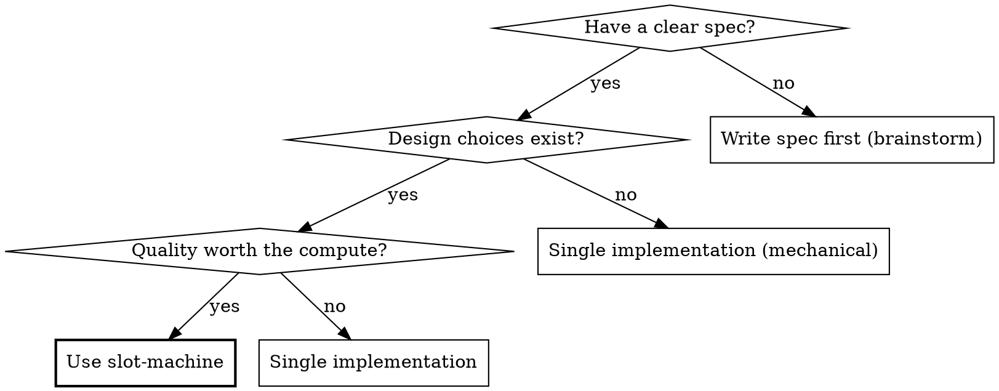

# Slot Machine

**Best-of-N parallel implementation for any task type.**

Run N independent attempts at the same spec in parallel. Review each. Pick the best — or synthesize the best elements into a single winner.

**Core principle:** LLMs are probabilistic. More attempts = better outcomes. Trade compute for quality.

**Announce at start:** "I'm using the slot-machine skill ({profile_name} profile) to run N parallel implementations."

## What This Is NOT

Standard multi-agent patterns split DIFFERENT tasks across agents (frontend, backend, tests in parallel). Every major tool does this — it's table stakes.

**Slot-machine gives the SAME spec to N agents and compares their FULL attempts.** The value isn't parallelism — it's competition and selection. Each slot is an independent attempt at the same task, not a piece of a divided workload. This applies to any task type — coding, writing, or custom profiles.

If you want to split a plan into parallel tasks, use **superpowers:dispatching-parallel-agents** instead.

## When to Use



**Use when:**
- Feature is well-specified (clear enough for independent implementation)
- Quality matters more than speed or cost
- Medium complexity (1-4 hours of agent work per attempt)
- Implementation has meaningful design choices (architecture, patterns, tradeoffs)

**Don't use when:**
- Simple mechanical changes (rename, add a field, update a config)
- Feature needs heavy human-in-the-loop iteration during implementation
- You already know exactly how it should be built
- Spec is too vague for independent attempts (brainstorm first)
- Task is purely mechanical with no design choices — 5 attempts at "add a column" is burning money

## Configuration

Check for config in project's `CLAUDE.md`, `AGENTS.md`, or equivalent. User can override inline (e.g., "slot-machine this with 3 slots").

| Setting | Default | Description |
|---------|---------|-------------|
| `slots` | 5 | Number of parallel attempts |
| `approach_hints` | true | Give each slot a different architectural direction |
| `auto_synthesize` | true | Allow judge to combine elements from multiple slots |
| `max_retries` | 1 | Re-run failed slots (0 = no retry) |
| `cleanup` | true | Delete worktrees after completion |
| `quiet` | false | Suppress progress tables — only show final verdict + output path. For autonomous loops. |
| `implementer_model` | inherit | Model for implementer subagents (inherits from session if not set) |
| `reviewer_model` | inherit | Model for reviewer subagents (inherits from session if not set) |
| `judge_model` | inherit | Model for judge subagent (inherits from session if not set) |
| `synthesizer_model` | inherit | Model for synthesizer subagent (inherits from session if not set) |

## Profile Loading

Profiles define the task-specific content for a slot-machine run: approach hints, agent prompts, isolation strategy, and pre-check commands. SKILL.md is a domain-agnostic orchestration engine — all task-specific content comes from the active profile.

### Profile Discovery (order of precedence)

1. **Explicit:** user says `--profile X` or `profile: X`
2. **Project default:** `CLAUDE.md` sets `slot-machine-profile: X`
3. **Local:** `./profiles/` folders in the project
4. **User:** `~/.slot-machine/profiles/` (community or personal profiles)
5. **Skill:** `profiles/` in the slot-machine skill directory (the built-in profiles)
6. **Fallback:** `coding`

### Profile Selection Logic

- If explicit or project-configured → use it
- If not → auto-detect between coding/writing from spec signals:
  - **Coding signals:** implement, build, create, fix, refactor; references to tests, APIs, functions
  - **Writing signals:** write, draft, compose, describe; references to audience, tone, structure
- If not confident → ask one question: "This spec could be a coding task or a writing task. Which profile should I use?"

### Profile Inheritance Resolution

- If profile has `extends: X`, read base profile X first
- Overlay the extending profile's files on top
- Files present in extending profile's folder replace base files entirely
- Missing files are inherited from the base folder
- Frontmatter fields override individually
- Max one level of inheritance

### Universal Variables

SKILL.md injects these variables into ALL profile prompts. If a variable isn't relevant for the active profile (e.g., `{{PRE_CHECK_RESULTS}}` for writing), pass an empty string.

| Variable | Description |
|----------|-------------|
| `{{SPEC}}` | Full text of the spec/brief |
| `{{APPROACH_HINT}}` | The hint assigned to this slot |
| `{{PROJECT_CONTEXT}}` | README, architecture notes, CLAUDE.md conventions, reference materials |
| `{{SLOT_NUMBER}}` | This slot's number |
| `{{PRE_CHECK_RESULTS}}` | Output from pre-check commands (empty string if `pre_checks` is null) |
| `{{IMPLEMENTER_REPORT}}` | The implementer's status report |
| `{{WORKTREE_PATH}}` | Path to this slot's worktree or output file |
| `{{ALL_SCORECARDS}}` | All reviewer scorecards concatenated |
| `{{WORKTREE_PATHS}}` | List of all slot worktree/output paths |
| `{{SLOT_COUNT}}` | Number of successful slots |
| `{{SYNTHESIS_PLAN}}` | The judge's synthesis plan |
| `{{BASE_SLOT_PATH}}` | The worktree/output path of the base slot |
| `{{APPROACH_HINT_USED}}` | The approach hint given to the implementer (used in reviewer context) |
| `{{TEST_COMMAND}}` | How to run the test suite (empty string if not applicable) |

## Slot Definitions

Slots can be configured per-slot instead of using the same profile implementer for all. Two axes compose with `+`:

- **Skills** (`/superpowers:tdd`, `/ce:work`) — methodology guidance, slash-prefixed. Injected into the prompt of whatever harness runs the slot.
- **Harnesses** (`codex`, `gemini`) — which AI system executes. No slash prefix. Determines the dispatch mechanism.

### Slot Definition Sources (precedence)

1. **Inline:** Parsed from the user's command. Slash-prefixed names are skills, bare names are harnesses. `+` composes them. `default` means profile implementer + approach hint.
2. **CLAUDE.md config:** Read `slot-machine-slots` list if present:
   ```markdown
   slot-machine-slots:
     - /superpowers:tdd
     - /ce:work
     - codex
     - /superpowers:tdd + codex
     - default
   ```
3. **Profile defaults:** If no slot definitions found, all slots use the profile's implementer prompt with randomly assigned approach hints. This is the Phase 1 behavior — unchanged.

### Parsing Rules

- If the user specifies slot definitions AND a slot count higher than the number of definitions, remaining slots get profile defaults with approach hints
- If the user specifies only slot definitions (no count), the slot count equals the number of definitions
- Each slot definition is a tuple: `(skill, harness)`:
  - `default` → `(null, null)` — profile implementer + hint
  - `/superpowers:tdd` → `("/superpowers:tdd", null)` — Claude Code with skill
  - `codex` → `(null, "codex")` — Codex with generic prompt
  - `/superpowers:tdd + codex` → `("/superpowers:tdd", "codex")` — Codex with skill

### Approach Hints and Skill Slots

Approach hints only apply to `default` slots. Skill-based slots do NOT get approach hints — the skill IS the diversity mechanism. When mixing skill and default slots, assign hints only to the default slots.

### Poor Slot Candidate Warning

If a parsed skill name matches a known multi-agent orchestrator (`/superpowers:subagent-driven-development`, `/superpowers:executing-plans`), warn the user: "⚠ {skill} is a multi-agent orchestrator — running it inside a slot creates nested pipelines (slower, redundant review). Consider using a single-session skill like /superpowers:tdd instead." Do not block — the user may have a reason.

## Skill Discovery

When the user says "all my skills", "all implementation skills", or uses `--discover`, the orchestrator scans for available slot-compatible skills and proposes a slot configuration.

### Trigger Rules (strict — never auto-fires)

| User says | Discovery fires? |
|-----------|-----------------|
| `/slot-machine this` | No — default profile + hints |
| `/slot-machine this with 3 slots` | No — default hints |
| `/slot-machine this with /superpowers:tdd and codex` | No — explicit list |
| `/slot-machine this with all my skills` | **Yes** |
| `/slot-machine this using all implementation skills` | **Yes** |
| `/slot-machine --discover` | **Yes** |

Discovery ONLY fires on explicit "all my/implementation skills" language or `--discover`. Never as a suggestion. Never as a default.

### Detection Heuristic

1. Read skill descriptions from the system prompt
2. Filter by signals:
   - **Include:** "implement", "build", "execute plan", "write code", "development workflow"
   - **Exclude:** "review", "deploy", "ship", "test-only", "audit", "monitor", "debug"
3. Filter out known poor candidates: `/superpowers:subagent-driven-development`, `/superpowers:executing-plans`
4. Check for external harnesses: run `which codex`, `which gemini` via Bash
5. Propose the filtered list to the user

### First-Time Flow

```
I scanned your installed skills and detected these slot-compatible workflows:

  1. /superpowers:tdd — test-first development
  2. /ce:work — pattern-matching execution
  3. codex — OpenAI Codex (external harness)

Use all 3 as slots? Or adjust?
```

User confirms or edits. Save selection to `~/.slot-machine/config.md`:

```markdown
## Discovered Implementation Skills
- /superpowers:tdd
- /ce:work
- codex
```

### Subsequent Runs

"All my skills" loads the saved list without re-scanning. User can re-trigger a fresh scan with `--discover`.

## The Process

### Phase 1: Setup

0. **Load profile.** Follow the [Profile Loading](#profile-loading) section to find the active profile folder and read `profile.md` from it for config. Report to user: "Using profile: {profile_name}"

1. **Parse slot definitions.** Check for slot definitions in precedence order: (1) inline in the user's command, (2) `slot-machine-slots` in CLAUDE.md, (3) fall back to profile defaults. Record the slot list — each slot is `(skill, harness)` or `default`. Check harness availability (see below).

   **Check harness availability.** For each slot that specifies a harness:
   - `codex`: Run `which codex` via Bash. If not found, warn: 'Codex CLI not found — slot {i} will fall back to Claude Code. Install: `npm install -g @openai/codex`'. Change the slot's harness to `null` (falls back to Claude Code with the same skill guidance if any).
   - Future harnesses: same pattern — check binary, warn and fall back if missing.

2. **Validate the spec.** The spec (plan, requirements doc, or inline description) must be concrete enough for independent attempts. If ambiguous — stop and ask for clarification before spending compute.

   Red flags that mean "not ready":
   - "Something like..." or "maybe we could..."
   - Missing acceptance criteria
   - References to external context not provided
   - Contradictory requirements

3. **Gather project context.** Collect what implementers need:
   - README or architecture docs (if they exist)
   - Key file descriptions relevant to the task
   - Test patterns and how to run tests (if applicable)
   - Any CLAUDE.md conventions
   - Reference materials, style guides, or source material (for writing tasks)

   Keep context focused — don't dump everything. Implementers should get just enough to orient themselves.

4. **Create run directory.** Create the run storage directory and add `.slot-machine/` to `.gitignore` if not already present:
   ```bash
   RUN_DIR=".slot-machine/runs/$(date +%Y-%m-%d)-{feature_slug}"
   mkdir -p "$RUN_DIR"
   grep -q '.slot-machine/' .gitignore 2>/dev/null || echo '.slot-machine/' >> .gitignore
   ```
   All artifacts from this run will be saved to `{RUN_DIR}/`.

5. **Prepare isolation.** Check the profile's `isolation` field:
   - If `worktree`: The project MUST be a git repository with at least one commit before Phase 2 can create worktrees. If the directory is not a git repo or has no commits:
     ```bash
     git init && git add -A && git commit -m "initial commit"
     ```
     Without this, `isolation: "worktree"` on Agent calls will fail and agents will not get isolated workspaces.
   - If `file`: No git repo required. Each slot will write its output to `{RUN_DIR}/slot-{i}.md`.

6. **Run pre-checks (if configured).** Read the active profile's `profile.md` frontmatter for the `pre_checks` field.
   - If `null` → skip this step.
   - If set → run the pre-check commands, substituting `{test_command}` with the detected test command. These establish the baseline. If baseline checks fail, stop and fix first.

7. **Assign approach hints.** If `approach_hints` is enabled, read hints from the active profile's `profile.md`. Randomly assign one hint per slot (without replacement). Each hint steers toward a different approach — the profile defines what diversity means for this task type.

8. **Report setup to user** using this format (top-level markdown, not inside a code block):

   **Slot Machine** — `{profile_name}` profile

   Feature: {feature_name}
   Slots: `{N}` | /superpowers:tdd, /ce:work, codex, 2x default hints

   When all slots use profile defaults (no slot definitions):

   Slots: `{N}` | Hints: {hint_1}, {hint_2}, ...

   Formatting rules for ALL orchestrator output (apply throughout Phases 1-4):
   - Tables MUST be top-level markdown — never indented or inside code blocks
   - Status values in backticks: `DONE`, `PASS`, `FAIL`, `HIGH`, `MEDIUM`, `LOW`
   - Profile name and key numbers in backticks
   - Bold for phase labels and verdicts
   - No italics anywhere — they de-emphasize in monospace terminals
   - Blockquote (`>`) for the verdict section only
   - H1 (`#`) for Final Output header only

### Phase 2: Parallel Implementation

**Dispatch depends on the slot definition.** For each slot, determine the dispatch path:

**Group 1 — Claude Code slots (Agent tool):** All slots where `harness` is `null` (default slots and skill-only slots). Dispatch all Group 1 slots in a SINGLE message using parallel Agent tool calls.

**Group 2 — Codex slots (CLI):** All slots where `harness` is `codex`. Dispatch all Group 2 slots in parallel using background Bash commands (one per slot, using Bash tool with `run_in_background: true` and `timeout: 300000`).

Both groups can run concurrently — dispatch Group 1 and Group 2 in the same message if possible, or Group 1 first then Group 2 immediately after. Collect all results after both groups complete.

---

**Path A — Default slots (no skill, no harness):**

Unchanged from Phase 1. Read `1-implementer.md` from the active profile, fill universal `{{VARIABLES}}`, include the assigned approach hint. Dispatch via Agent tool with `isolation: "worktree"` (or omit if `file` profile).

For each slot i (1 to N), make an Agent tool call with:

| Parameter | Value |
|-----------|-------|
| `description` | `"Slot {i}: Implement {feature_name}"` |
| `isolation` | `"worktree"` if profile isolation is `worktree`; omit if `file` |
| `model` | Omit unless user configured `implementer_model` — inherits from session by default |
| `prompt` | Read `implementer.md` from the active profile's folder and fill in all universal `{{VARIABLES}}` |

The universal variables to fill in the implementer prompt:

| Variable | Source |
|----------|--------|
| `{{SPEC}}` | Full text of the spec — paste it, don't make the subagent read a file |
| `{{APPROACH_HINT}}` | The hint assigned to this slot (or omit section if hints disabled) |
| `{{PROJECT_CONTEXT}}` | README, architecture notes, CLAUDE.md conventions, reference materials gathered in Phase 1. Include any user-specified skill guidance. |
| `{{TEST_COMMAND}}` | How to run the test suite (empty string if not applicable) |

**For `file` isolation:** Each slot writes its output to `{RUN_DIR}/slot-{i}.md`. Include this path in the prompt so the implementer knows where to write. No worktrees, no git branches.

**For `worktree` isolation — worktree fallback:** If `isolation: "worktree"` fails (e.g., git repo not detected, permission issues), fall back to manual worktree creation:

```bash
for i in $(seq 1 $N); do
    git worktree add "../{feature_name}-slot-$i" -b "slot-machine/{feature_name}/slot-$i"
done
```

Then dispatch implementers WITHOUT `isolation: "worktree"`, pointing each to its worktree directory. Track worktree paths manually for cleanup in Phase 4. For `worktree` isolation, save each slot's diff to `{RUN_DIR}/slot-{i}.diff` before cleanup.

---

**Path B — Skill-only slots (e.g., `/superpowers:tdd`, no harness):**

Do NOT read the profile's `1-implementer.md`. Dispatch via Agent tool with this prompt:

```
You are implementing a feature in an isolated workspace.

IMPORTANT: You MUST invoke the {skill_name} skill using the Skill tool before beginning implementation. Follow its workflow exactly.

Specification:
{spec}

Project Context:
{project_context}

After implementation is complete, end with this report format:
**Status:** [DONE | DONE_WITH_CONCERNS | BLOCKED | NEEDS_CONTEXT]
**What I implemented:** [bullet list]
**Files changed:** [list]
**Test results:** [if applicable]
**Concerns (if any):** [issues]
```

Use `isolation: "worktree"` on the Agent call. Do NOT include an approach hint — the skill is the diversity mechanism.

---

**Path C — Codex slots (harness = `codex`, with or without skill):**

Do NOT use the Agent tool. Dispatch via Bash:

1. Create a git worktree for this slot (same as Claude Code slots):
   ```bash
   git worktree add "../slot-machine-{feature}-slot-{i}" -b "slot-machine/{feature}/slot-{i}"
   ```

2. Run `codex exec` pointed at the worktree. Use the Bash tool with `timeout: 300000` (5 minutes) and `run_in_background: true`. The `--json` flag emits JSONL output — pipe it through the Python parser below to extract the agent's final report:

   ```bash
   cd {worktree_path} && codex exec "Implement this specification. Write all files to the current directory.

   {If skill specified: 'METHODOLOGY: Follow {skill_name} principles — e.g., for TDD: write failing tests first, verify they fail, then implement minimal code to pass, verify all tests pass.'}

   Specification:
   {spec}

   Project context:
   {project_context}

   When done, provide a summary of:
   - What you implemented (bullet list)
   - Files created or modified
   - Test results if you wrote tests
   - Any concerns or issues encountered" \
     -s workspace-write \
     -c 'model_reasoning_effort="high"' \
     --json 2>{RUN_DIR}/slot-{i}-codex-stderr.txt | python3 -c "
   import sys, json
   for line in sys.stdin:
       line = line.strip()
       if not line: continue
       try:
           obj = json.loads(line)
           t = obj.get('type', '')
           if t == 'item.completed' and 'item' in obj:
               item = obj['item']
               if item.get('type') == 'agent_message' and item.get('text'):
                   print(item['text'])
               elif item.get('type') == 'command_execution':
                   cmd = item.get('command', '')
                   if cmd: print(f'[codex ran] {cmd}')
       except: pass
   " > {RUN_DIR}/slot-{i}-report.txt
   ```

3. After `codex exec` completes, check for failures:
   - Non-zero exit code → mark FAILED, save stderr for debugging
   - Empty report file (`{RUN_DIR}/slot-{i}-report.txt` is 0 bytes) → mark FAILED
   - Timeout (Bash tool returns timeout) → mark FAILED
   - On any failure, save whatever output exists to the run dir. The slot is marked FAILED but the run continues.

---

| Slot definition | Dispatch | Prompt | Isolation | Hint? |
|----------------|----------|--------|-----------|-------|
| `default` | Agent tool (parallel Group 1) | Profile `1-implementer.md` + hint | Profile setting | Yes |
| `/superpowers:tdd` | Agent tool (parallel Group 1) | "Invoke {skill} via Skill tool" + spec | worktree | No |
| `codex` | `codex exec` CLI (parallel Group 2) | Generic "implement this" + spec | worktree (manual) | No |
| `/superpowers:tdd + codex` | `codex exec` CLI (parallel Group 2) | Skill methodology + spec | worktree (manual) | No |

---

**After all agents return**, process each result:

| Result | Action |
|--------|--------|
| Agent succeeded, implementer status DONE | Record worktree path + branch (worktree isolation) or output file path (file isolation). Save implementer report. |
| Agent succeeded, status DONE_WITH_CONCERNS | Record path. Save report including concerns. |
| Agent succeeded, status BLOCKED or NEEDS_CONTEXT | If `max_retries` > 0: re-dispatch with additional context. Else: mark FAILED. |
| Agent errored/crashed | If `max_retries` > 0: re-dispatch fresh. Else: mark FAILED. |

**Retry handling:** When retrying, dispatch a SINGLE Agent call (not parallel) with the same template but additional context addressing the block. Use a fresh subagent — don't try to continue the failed one.

**Report progress** using a top-level markdown table. For writing profiles, show word count. For coding profiles, show test count. Include a one-line summary of each slot's approach (from the hint influence):

**Phase 2:** Implementation — `done`

| Slot | Via | Status | Words/Tests | Approach |
|------|-----|--------|-------------|----------|
| 1 | `Claude` | `DONE` | 13 tests | /superpowers:tdd |
| 2 | `Codex` | `DONE` | 15 tests | /superpowers:tdd + codex |
| 3 | `Claude` | `DONE` | 21 tests | /ce:work |
| 4 | `Codex` | `DONE_WITH_CONCERNS` | 8 tests | codex |

Do NOT show full implementer reports, self-review findings, or file lists. The table summarizes the essential information. Agent internals are pipeline noise.

**Minimum viable:** At least 2 successful slots needed for meaningful comparison. If fewer than 2 succeed, report to user and recommend: re-run with different slot count, fix spec issues, or manual implementation.

### Phase 3: Review and Judgment

**The review/judgment pipeline is the skill's core value.** Baseline testing showed that Claude naturally does parallel dispatch and even synthesis — but it centralizes all evaluation in the orchestrator. This phase delegates evaluation to specialized agents for higher-quality, unbiased assessment.

#### Step 0: Run pre-checks (before LLM reviewers)

Run the pre-check commands defined in the active profile's `profile.md` frontmatter. If `pre_checks` is `null`, skip pre-checks entirely and pass an empty string for `{{PRE_CHECK_RESULTS}}`.

If `pre_checks` is set: for each successful slot, run the commands in the slot's worktree (for `worktree` isolation) or against the slot's output file (for `file` isolation). Before running, substitute `{test_command}` with the test command detected during Phase 1.

Feed ALL pre-check results to the reviewer as `{{PRE_CHECK_RESULTS}}`. The more factual data the reviewer has, the less it has to discover — and the more it can focus on judgment calls that require reasoning.

Collect results as `{{PRE_CHECK_RESULTS}}` for each slot.

#### Step 1: Dispatch reviewers for all successful slots

**Dispatch all reviewers in a SINGLE message** — one parallel Agent tool call per successful slot.

For each successful slot i, make an Agent tool call with:

| Parameter | Value |
|-----------|-------|
| `description` | `"Review Slot {i} implementation"` |
| `model` | Omit unless user configured `reviewer_model` — inherits from session by default |
| `prompt` | Read `reviewer.md` from the active profile's folder and fill in all universal `{{VARIABLES}}` |

The universal variables to fill in the reviewer prompt:

| Variable | Source |
|----------|--------|
| `{{SPEC}}` | Full text of the original spec |
| `{{IMPLEMENTER_REPORT}}` | The implementer's status report (what they claim they built) |
| `{{WORKTREE_PATH}}` | Path to this slot's worktree or output file (from Phase 2 results) |
| `{{SLOT_NUMBER}}` | This slot's number |
| `{{PRE_CHECK_RESULTS}}` | Pre-check output from Step 0 (empty string if pre_checks is null) |
| `{{APPROACH_HINT_USED}}` | The approach hint that was given to this slot's implementer |

The reviewer reads actual content in the worktree/output file — it does NOT have `isolation: "worktree"` (it inspects existing work, not its own workspace).

After all reviewers return, collect all reviews. Save each reviewer's scorecard to `{RUN_DIR}/review-{i}.md`. **Report review results** using a top-level markdown table and standout bullets. Do NOT show full reviewer scorecards, evidence chains, or pass-by-pass analysis — those are pipeline internals the judge uses, not the user.

**Phase 3:** Review — `done`

| Slot | Compliance | Critical | Important | Minor | Verdict |
|------|------------|----------|-----------|-------|---------|
| 1 | `PASS` | 0 | 0 | 3 | **Contender** |
| 2 | `PASS` | 0 | 1 | 2 | **Contender** |
| 3 | `FAIL` | 1 | 0 | 1 | Eliminated |

**Standout elements:**
- Slot 1: {the reviewer's top strength for this slot — one line}
- Slot 2: {the reviewer's top strength}

Extract standout elements from each reviewer's "Strengths" section. Pick the single most notable strength per slot — the one the judge is most likely to care about.

#### Step 2: Dispatch the judge

Make a SINGLE Agent tool call. **The judge MUST use the most capable model** — this is where architectural judgment matters most:

| Parameter | Value |
|-----------|-------|
| `description` | `"Judge Slot Machine results for {feature_name}"` |
| `model` | Omit unless user configured `judge_model` — inherits from session by default. The judge benefits from the most capable model available. |
| `prompt` | Read `judge.md` from the active profile's folder and fill in all universal `{{VARIABLES}}` |

The universal variables to fill in the judge prompt:

| Variable | Source |
|----------|--------|
| `{{SPEC}}` | Full text of the original spec |
| `{{ALL_SCORECARDS}}` | All reviewer scorecards concatenated |
| `{{WORKTREE_PATHS}}` | List of all slot worktree/output paths (for targeted inspection) |
| `{{SLOT_COUNT}}` | Number of successful slots |

The judge returns one of three verdicts:
- **PICK** — one slot is the clear winner
- **SYNTHESIZE** — multiple slots have complementary strengths worth combining
- **NONE_ADEQUATE** — all slots have critical issues

Save the judge's full verdict and reasoning to `{RUN_DIR}/verdict.md`.

**Report the verdict** using a blockquote. This is the most important output before the final result — make it visually distinct:

**Phase 4:** Verdict

> **SYNTHESIZE** — `HIGH` confidence
>
> **Base:** Slot 3 — strongest voice, best opener
> **+ Slot 2:** problem sentence, lock-in footer
> **+ Slot 1:** fzf detail, escape-hatch framing
> **Cut:** "How it works" section — out of scope

For PICK verdicts, the blockquote is simpler:

> **PICK Slot 2** — `HIGH` confidence
>
> Zero critical issues, strongest test coverage (45 tests), correct lock granularity

### Phase 4: Resolution

#### If PICK:

**For `worktree` isolation:**

1. The judge named a winning slot. Merge its branch:
   ```bash
   # From the main working directory
   git merge {winning_branch} --no-ff -m "feat: {feature_name} (slot-machine winner: slot {N})"
   ```

2. Run the full test suite to verify the merge is clean.

3. If tests fail: investigate. The worktree passed tests in isolation — merge conflicts or environment differences are the likely cause. Fix before proceeding.

**For `file` isolation:**

1. Copy the winning slot's output file to the target location specified in the spec (or ask the user where to place it).
2. Report the winning output to the user.

#### If SYNTHESIZE:

1. The judge produced a concrete synthesis plan (which base slot, what to port from where).

2. Dispatch the synthesizer as a SINGLE Agent tool call:

   | Parameter | Value |
   |-----------|-------|
   | `description` | `"Synthesize best elements for {feature_name}"` |
   | `isolation` | `"worktree"` if profile isolation is `worktree`; omit if `file` |
   | `model` | Omit unless user configured `synthesizer_model` — inherits from session by default |
   | `prompt` | Read `synthesizer.md` from the active profile's folder and fill in all universal `{{VARIABLES}}` |

   The universal variables to fill in the synthesizer prompt:

   | Variable | Source |
   |----------|--------|
   | `{{SPEC}}` | Full text of the spec |
   | `{{SYNTHESIS_PLAN}}` | The judge's synthesis plan (which base, what to port) |
   | `{{WORKTREE_PATHS}}` | All slot worktree/output paths the synthesizer needs to read from |
   | `{{BASE_SLOT_PATH}}` | The worktree/output path of the base slot specifically |

3. Run full test suite to verify (for `worktree` isolation). For `file` isolation, the synthesizer writes its output to `{RUN_DIR}/output.md` (or appropriate extension). Tell the synthesizer this destination path in its prompt.

4. **Post-synthesis review.** Dispatch ONE reviewer to check the synthesized result for integration issues:

   | Parameter | Value |
   |-----------|-------|
   | `description` | `"Review synthesis for {feature_name}"` |
   | `model` | Omit unless user configured `reviewer_model` — inherits from session by default |
   | `prompt` | Read `reviewer.md` from the active profile's folder and fill in `{{VARIABLES}}` using the synthesis worktree/output |

   The reviewer checks:
   - Coherence: does it read like one person wrote it?
   - Integration: did porting introduce bugs, naming conflicts, or tonal inconsistencies?
   - Coverage: did any requirements get dropped during synthesis?

   If the reviewer finds critical issues, fix them before finalizing. Important/minor issues can be noted in the final report.

5. **Finalize the synthesis:**
   - For `worktree` isolation: merge the synthesis branch:
     ```bash
     git merge {synthesis_branch} --no-ff -m "feat: {feature_name} (slot-machine synthesis: slot {base} base + elements from slots {donors})"
     ```
   - For `file` isolation: copy the synthesized output file to the target location.

#### If NONE_ADEQUATE:

1. Report the judge's analysis to the user.
2. Recommend next steps based on judge's reasoning:
   - Re-run with an adjusted or clarified spec
   - Re-run with more slots
   - Manual intervention on the best attempt
   - Abandon and rethink the approach
3. **Do NOT auto-retry** — the user decides.

#### Cleanup

If `cleanup` is true (default):

**For `worktree` isolation:** remove all worktrees:

```bash
# For each worktree path tracked during the run:
git worktree remove {worktree_path} --force
# The --force handles uncommitted changes in non-winning slots

# Branches are cleaned up automatically if they were only in the worktree
# For any lingering branches:
git branch -D {branch_name}
```

Slot diffs are preserved in `{RUN_DIR}/`.

**For `file` isolation:** Run artifacts are kept permanently — no cleanup needed. All slot outputs, reviews, and the verdict remain in `{RUN_DIR}/`.

If `cleanup` is false, report worktree/output locations so the user can inspect them.

#### Final Report

The final report has three parts: the H1 header, the output content, and the footer line.

**Part 1: H1 header** (use markdown `#` — this is the most visually distinct element):

# Final Output

**Part 2: Output content** — depends on profile isolation and output length:

**For `file` isolation (writing):** Count lines in the final output file. The winner (or synthesis) is saved to `{RUN_DIR}/output.md`.
- If ≤ 60 lines: show the full content inline after the header.
- If > 60 lines: show the first ~20 lines, then: `Full output at \`.slot-machine/runs/{date}-{feature}/output.md\``

**For `worktree` isolation (coding):** Show a file change summary table:

# Final Output — merged to `{branch}`

| File | Lines | What |
|------|-------|------|
| src/task_queue.py | +142 | TaskQueue class with priority support |
| tests/test_task_queue.py | +245 | 45 tests including concurrency |

`3` files changed, `474` insertions
`45` tests passing

**Part 3: Result artifact** — always write a machine-readable JSON file to the run directory:

```bash
cat > {RUN_DIR}/result.json << RESULT
{
  "verdict": "{PICK|SYNTHESIZE|NONE_ADEQUATE}",
  "winning_slot": {N or null},
  "confidence": "{HIGH|MEDIUM|LOW}",
  "slots": {total},
  "slots_succeeded": {succeeded},
  "files_changed": [{list}],
  "tests_passing": {count or null},
  "run_dir": "{RUN_DIR}"
}
RESULT

# Create latest symlink for easy script access
ln -sfn "$(basename {RUN_DIR})" "$(dirname {RUN_DIR})/latest"
```

This is always written, every run. Humans ignore it. Autonomous loops and scripts parse it via `.slot-machine/runs/latest/result.json`.

**Part 4: Footer** — a horizontal rule followed by a one-line summary:

---

**Complete** — `{word_count} words` | `{N} slots` | `{verdict}`

**Quiet mode:** If `quiet: true` is set, suppress all Phase 2-3 progress tables and standout elements. Only output the Phase 4 verdict blockquote, the Final Output section, and the footer. The run directory still has everything for post-hoc inspection.

#### Metrics (optional)

If the project has a `.slot-machine/` directory (or `metrics_dir` is configured), write run metrics:

```bash
mkdir -p .slot-machine
cat > .slot-machine/run-$(date +%Y%m%d-%H%M%S).json << 'METRICS'
{
  "schema_version": 1,
  "timestamp": "...",
  "feature": "...",
  "config": { "slots": N, ... },
  "results": { "verdict": "...", ... },
  "reviewers": { ... },
  "agents": { "total_dispatched": N, ... },
  "final_output": { "test_count": N, ... }
}
METRICS
```

See `tests/fixtures/sample-metrics.json` for the full schema. Metrics enable tracking improvement across runs — which approach hints win, how often synthesis triggers, whether reviewer differentiation improves over time.

The `reviewers` section tracks effectiveness per slot: `findings_total`, `findings_acted_on` (used by judge), `findings_ignored` (correct but unused), `false_positives`. The `convergent_findings` array lists issues found independently by multiple reviewers — these are the highest-confidence signals. When golden issues are available (from planted-bug test fixtures), `precision` and `recall` are computed.

## Implementer Status Handling

Implementer subagents report one of four statuses in their output:

| Status | Meaning | Orchestrator Action |
|--------|---------|-------------------|
| **DONE** | Implementation complete, tests pass | Proceed to review |
| **DONE_WITH_CONCERNS** | Complete but implementer has reservations | Proceed to review — include concerns in reviewer context |
| **BLOCKED** | Can't proceed — architectural uncertainty, missing info | Retry with more context if retries remain. If still blocked, mark failed. |
| **NEEDS_CONTEXT** | Spec is ambiguous or missing information | Provide the missing context and re-dispatch. If context isn't available, mark failed. |

**Never ignore BLOCKED or NEEDS_CONTEXT.** These indicate real problems. Forcing a retry without changes produces the same failure.

## Model Selection

By default, all agents inherit the model from your current session. If you're running Opus, every slot gets Opus. If you're running Sonnet, every slot gets Sonnet. This means you always get the quality level you're paying for.

To override, set model configs in your project's `CLAUDE.md` or inline. Only pass the `model` parameter to the Agent tool when the user has explicitly configured an override — otherwise omit it so the session model is inherited.

| Role | Default | Configurable As | When to override |
|------|---------|-----------------|------------------|
| Implementer | inherit | `implementer_model` | Downgrade to save cost on mechanical tasks |
| Reviewer | inherit | `reviewer_model` | Downgrade to save cost on structured evaluation |
| Judge | inherit | `judge_model` | Upgrade if running a cheaper session model |
| Synthesizer | inherit | `synthesizer_model` | Upgrade if running a cheaper session model |

## Approach Hints

Approach hints are defined in the active profile's `profile.md`. See `profiles/coding/0-profile.md` for the coding defaults and `profiles/writing/0-profile.md` for writing defaults.

When `approach_hints` is enabled (default: true), each slot gets a different hint to encourage genuinely divergent attempts. Assign randomly without replacement. The profile defines what "diversity" means for its task type — architectural diversity for coding, voice/structure diversity for writing.

## Common Mistakes

### Skipping spec validation
- **Problem:** Vague spec → N implementations that all miss the mark in different ways → expensive waste
- **Fix:** Validate spec is concrete enough BEFORE spinning up slots. If ambiguous, ask.

### Dumping too much context
- **Problem:** Giving implementers the entire codebase burns their context window on irrelevant information
- **Fix:** Curate context — README, relevant architecture notes, key files only. Implementers can read more if needed.

### Judge reading all code from scratch
- **Problem:** Judge burns context reading N full implementations
- **Fix:** Judge reads scorecards FIRST, only does targeted code inspection where scorecards diverge or flag issues

### Synthesis that creates Frankenstein code
- **Problem:** Cherry-picking from multiple implementations creates inconsistent code
- **Fix:** Synthesizer uses ONE slot as base, ports SPECIFIC elements. Full test suite must pass. Self-review for coherence.

### Running on mechanical tasks
- **Problem:** 5 parallel attempts at "add a field to this model" is burning money
- **Fix:** Only use slot-machine when implementation has meaningful design choices

### Retrying without changes
- **Problem:** Re-dispatching a BLOCKED slot with the same context produces the same failure
- **Fix:** Add context, clarify the spec, or provide the missing information before retrying

## Red Flags — STOP If You Catch Yourself Doing These

**The #1 baseline failure mode** (observed in Task 0 testing without the skill): the orchestrator reads all implementations itself, makes an ad hoc comparison, and writes the synthesis — centralizing everything instead of delegating to specialized reviewer/judge/synthesizer agents. The review and judgment pipeline IS the skill's value. Don't collapse it.

| Thought / Action | What's Wrong |
|-----------------|-------------|
| "I'll just read all the code and compare them myself" | **This is the most common shortcut.** Dispatch independent reviewer agents per slot. Your job is orchestration, not evaluation. Blind review by fresh agents prevents bias from seeing all implementations simultaneously. |
| "I'll make a quick comparison table instead of formal scorecards" | A comparison table is not a scorecard. Each slot needs independent review with 6 weighted criteria, issue categorization, and a verdict. The judge needs structured input, not your summary. |
| "I can write the synthesis myself, I've already read the code" | Dispatch the synthesizer agent. It works from the judge's plan with a single base + targeted ports. Ad hoc synthesis by the orchestrator produces Frankenstein code. |
| "I'll split the spec into different tasks for each slot" | That's standard parallel agents, not slot-machine. Each slot gets the FULL spec. |
| "3 slots is probably enough" | Use the configured count. User chose N for a reason. Don't second-guess. |
| "I'll skip the judge and just merge the highest scorer" | Judge does targeted code inspection. Scorecard alone isn't enough for the decision. |
| "Synthesis sounds risky, I'll just PICK" | If multiple slots have complementary strengths, synthesis produces a better result. Trust the process. |
| "This spec is probably clear enough" | Validate. Ambiguous specs × N slots = N different wrong implementations = expensive waste. |
| "Reviewing each separately is overkill" | Structured review is what makes judgment possible. Ad hoc comparison = ad hoc results. |

**All of these mean you're about to shortcut the review/judgment pipeline. That pipeline is the entire point of this skill.**

## Integration

- **superpowers:brainstorming** → Produces the spec that slot-machine consumes. Run brainstorming BEFORE slot-machine if requirements are unclear.
- **superpowers:writing-plans** → Can produce the plan/spec. Slot-machine gives the ENTIRE spec to each slot (not individual tasks).
- **superpowers:using-git-worktrees** → Slot-machine uses `isolation: "worktree"` which follows the same underlying git worktree mechanics.
- **superpowers:test-driven-development** → Each implementer should follow TDD if the project uses it. Include TDD guidance in the spec if applicable.
- **superpowers:finishing-a-development-branch** → After slot-machine produces a winner, use this for final merge/PR/cleanup.

**Key difference from subagent-driven-development:** SDD splits a plan into sequential tasks (one agent per task). Slot-machine gives the ENTIRE spec to N agents and compares their full implementations. They are complementary — you could use SDD within each slot for large features.
